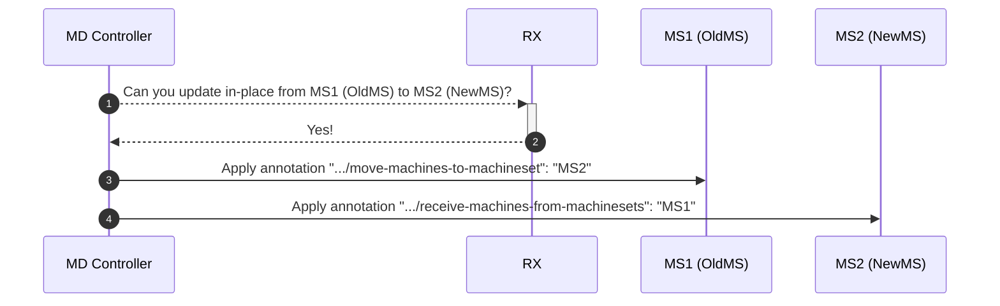
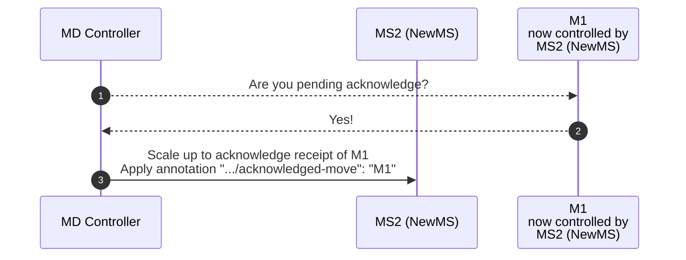
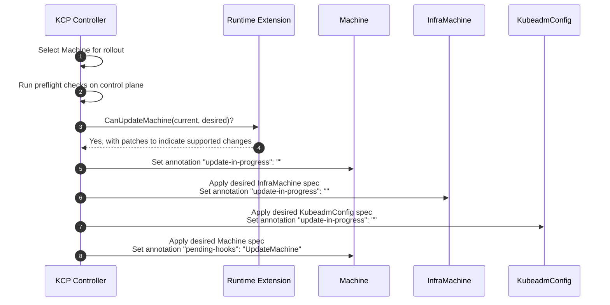
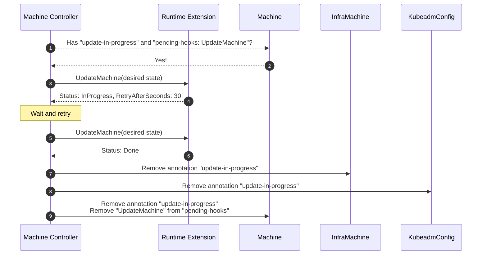
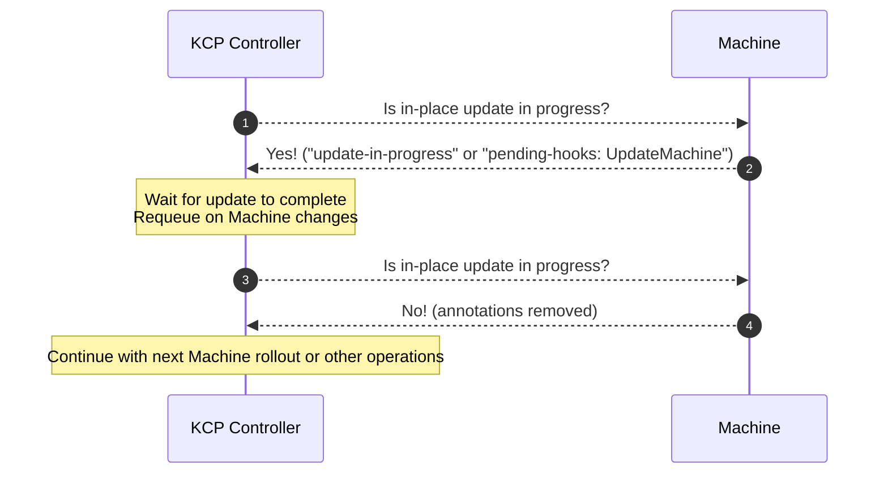

# In-place updates in Cluster API - Implementations notes

This document is a collection of notes about implementation details for the in-place update proposal.

As soon as the implementation will be completed, some of the notes in this document will be moved back
into the proposal or into the user-facing documentation for this feature.

## Notes about in-place update implementation for machine deployments

- In place is always considered as potentially disruptive
  - in place must respect maxUnavailable
    - if maxUnavailable is zero, a new machine must be created first, then as soon as there is “buffer” for in-place, in-place update can proceed
  - when in-place is possible, the system should try to in-place update as many machines as possible.
    - maxSurge is not fully used (it is used only for scale up by one if maxUnavailable =0)

- No in-place updates are performed when using rollout strategy on delete.

- The implementation respects the existing set of responsibilities of each controller:
  - MD controller manages MS:
    - MD controller enforces maxUnavailable, maxSurge
    - MD controller decides when to scale up newMS, when to scale down oldMS
    - When scaling down, the MD controller checks whether the operation can be performed in-place instead of delete/recreate. If in-place is possible:
      - Old MS is instructed to move machines to the newMS, and newMS is informed to receive machines from oldMS.
  - MS controller manages a subset of Machines
    - When scaling down the old MS, if required to move, MS controller is responsible for moving a Machine to newMS
    - When reconciling the new MachineSet, the MS controller takes ownership of the moved machine and begins the actual in-place update.

- Orchestration of in-place updates between MD controller, MS controller, and Machine controller is implemented using annotations.
  Following schemas provide an overview of how new annotations are used.

Workflow #1: MD controller detects an in-place update is possible and it informs oldMS and newMS about how to perform this operation.



Workflow #2: MS controller, when reconciling oldMS, move machines to the newMS.

```mermaid
sequenceDiagram
    autonumber
    participant MS Controller as MS Controller<br/>when reconciling<br/>MS1 (OldMS)
    participant MS1 (OldMS)
    participant MS2 (NewMS)
    participant M1 as M1<br/>controlled by<br/>MS1 (OldMS),<br/>selected to be moved to MS2 (NewMS)
    MS Controller-->>MS1 (OldMS): Are you scaling down?
    MS1 (OldMS)-->>MS Controller: Yes!
    MS Controller-->>MS1 (OldMS): Do you have the ".../move-machines-to-machineset" annotation?
    MS1 (OldMS)-->>MS Controller: Yes, I'm instructed to move machines to MS2!
    MS Controller-->>MS2 (NewMS): Do you have ".../receive-machines-from-machinesets" annotation?
    MS2 (NewMS)-->>MS Controller: Yes, I'm instructed to receive machines MS1!
    MS Controller->>M1: Move M1 to MS2 (NewMS)<br/>Apply annotation ".../pending-acknowledge-move": ""<br/>Apply annotation ".../update-in-progress": ""
```

MD controller recognizes that a Machine has been moved to the new MachineSet and scales up the new MachineSet to acknowledge the operation.



Workflow #4: MS controller, when reconciling newMS, detects that a machine has been acknowledged; it cleans up annotations on the machine, allowing the in-place update to begin.

```mermaid
sequenceDiagram
    autonumber
    participant MS Controller as MS Controller<br/>when reconciling<br/>MS2 (NewMS)
    participant MS2 (NewMS)
    participant M1 as M1<br/>now controlled by<br/>MS2 (NewMS)
    MS Controller-->>MS2 (NewMS): Is there some newly acknowledged replicas?
    MS2 (NewMS)-->>MS Controller: Yes, M1!
    MS Controller->>M1: Remove annotation ".../pending-acknowledge-move": ""
```

## Notes about in-place update implementation for KubeadmControlPlane

- In-place updates respect the existing control plane update strategy:
  - KCP controller uses `rollingUpdate` strategy with `maxSurge` (0 or 1)
  - When `maxSurge` is 0, no new machines are created during rollout; updates are performed only on existing machines via in-place updates or by scaling down outdated machines
  - When `maxSurge` is 1:
    - The controller first scales up by creating one new machine to maximize fault tolerance
    - Once `maxReplicas` (desiredReplicas + 1) is reached, it evaluates whether to in-place update or scale down old machines
    - For each old machine needing rollout, the controller evaluates if it is eligible for in-place update. If so, it performs the in-place update on that machine. Otherwise, it scales down the outdated machine (which will be replaced by a new one in the next reconciliation cycle)
    - This pattern repeats until all machines are up-to-date, it then scales back to the desired replica count
  
- The implementation respects the existing set of responsibilities:
  - KCP controller manages control plane Machines directly
    - KCP controller enforces `maxSurge` limits during rolling updates
    - KCP controller decides when to scale up, scale down, or perform in-place updates
    - KCP controller runs preflight checks to ensure the control plane is stable before in-place updates
    - KCP controller calls the `CanUpdateMachine` hook to verify if extensions can handle the changes
    - When in-place update is possible, the KCP controller triggers the update by reconciling the desired state

- The in-place update decision flow definition is:
  - If `currentReplicas < maxReplicas` (desiredReplicas + maxSurge), scale up first to maximize fault tolerance
  - If `currentReplicas >= maxReplicas`, select a machine needing rollout and evaluate options:
    - Check if selected Machine is eligible for in-place update (determined by `UpToDate` function)
    - Check if we already have enough up-to-date replicas (if `currentUpToDateReplicas >= desiredReplicas`, skip in-place and scale down)
    - Run preflight checks to ensure control plane stability
    - Call the `CanUpdateMachine` hook on registered runtime extensions
    - If all checks pass, trigger in-place update. Otherwise, fall back to scale down/recreate
  - This flow repeats on each reconciliation until all machines are up-to-date
  
- Orchestration of in-place updates uses two key annotations:
  - `in-place-updates.internal.cluster.x-k8s.io/update-in-progress` - Marks a Machine as undergoing in-place update
  - `runtime.cluster.x-k8s.io/pending-hooks` - Tracks pending `UpdateMachine` runtime hooks

The following schemas provide an overview of the in-place update workflow for KCP.

Workflow #1: KCP controller determines that a Machine can be updated in-place and triggers the update.



Workflow #2: The Machine controller detects the pending `UpdateMachine` hook and calls the runtime extension to perform the update.



Workflow #3: The KCP controller waits for in-place update to complete before proceeding with further operations.



## Notes about managedFields refactoring for in-place updates (KCP/MS)

To enable correct in-place updates of BootstrapConfigs and InfraMachines, CAPI v1.12 introduced a refactored managedFields structure. This change was necessary for the following reasons:

- In CAPI <= v1.11, BootstrapConfigs/InfraMachines were only created, never updated
- Starting with CAPI v1.12, BootstrapConfigs/InfraMachines need to be updated during in-place updates. SSA is used because it provides proper handling of co-ownership of fields and enables unsetting fields during updates

### A "two field managers" approach

The refactoring uses **two separate field managers** to enable different responsibilities:

1. **Metadata manager** (`capi-kubeadmcontrolplane-metadata` / `capi-machineset-metadata`):
   - Continuously syncs labels and annotations
   - Updates on every reconciliation via `syncMachines`

2. **Spec manager** (`capi-kubeadmcontrolplane` / `capi-machineset`):
   - Manages the spec and in-place update specific annotations
   - Updates only when creating objects or triggering in-place updates

### ManagedFields structure comparison

**CAPI <= v1.11** (legacy):
- Machine:
  - spec, labels, and annotations are owned by `capi-kubeadmcontrolplane` / `capi-machineset` (Apply)
- BootstrapConfig / InfraMachine:
  - labels and annotations are owned by `capi-kubeadmcontrolplane` / `capi-machineset` (Apply)
  - spec is owned by `manager` (Update)

**CAPI >= v1.12** (new):
- Machine (unchanged):
  - spec, labels, and annotations are owned by `capi-kubeadmcontrolplane` / `capi-machineset` (Apply)
- BootstrapConfig / InfraMachine:
  - labels and annotations are owned by `capi-kubeadmcontrolplane-metadata` / `capi-machineset-metadata` (Apply)
  - spec is owned by `capi-kubeadmcontrolplane` / `capi-machineset` (Apply)

### Object creation workflow (CAPI >= v1.12)

When creating new BootstrapConfig/InfraMachine:

1. **Initial creation**:
   - Apply BootstrapConfig/InfraMachine with spec (manager: `capi-kubeadmcontrolplane` / `capi-machineset`)
   - Remove managedFields for labels and annotations
   - Result: labels and annotations are orphaned, spec is owned

2. **First syncMachines call** (happens immediately after):
   - Apply labels and annotations (manager: `capi-kubeadmcontrolplane-metadata` / `capi-machineset-metadata`)
   - Result: Final desired managedField structure is established

3. **Ready for operations**:
   - Continuous `syncMachines` calls update labels/annotations without affecting the spec of a Machine
   - In-place updates can now properly update spec fields and unset fields as needed

### In-place update object modifications

When triggering in-place updates:

1. Apply BootstrapConfig/InfraMachine with:
   - Updated spec (owned by the spec manager)
   - `update-in-progress` annotation (owned by spec manager)
   - For InfraMachine: `cloned-from` annotations (owned by the spec manager)

2. Result after the in-place update trigger:
   - labels and annotations are owned by the metadata manager
   - spec is owned by the spec manager
   - in-progress and cloned-from annotations are owned by the spec manager
