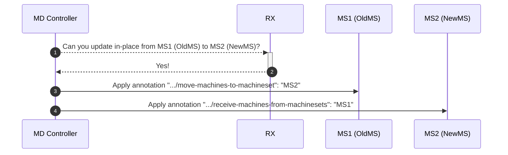
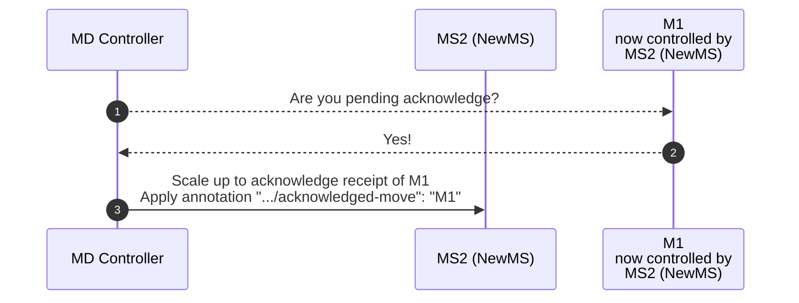

# In-place updates in Cluster API - Implementations notes

This document is a collection of notes about implementation details for the in-place update proposal.

As soon as the implementation will be completed, some of the notes in this document will be moved back
into the proposal or into the user-facing documentation for this feature.

## Notes about in-place update implementation for machine deployments

- In place is always considered as potentially disruptive
  - in place must respect maxUnavailable
    - if maxUnavailable is zero, a new machine must be created first, then as soon as there is “buffer” for in-place, in-place update can proceed
  - when in-place is possible, the system should try to in-place update as many machines as possible.
    - maxSurge is not fully used (it is used only for scale up by one if maxUnavailable =0)

- No in-place updates are performed when using rollout strategy on delete.

- The implementation respects the existing set of responsibilities of each controller:
  - MD controller manages MS:
    - MD controller enforces maxUnavailable, maxSurge
    - MD controller decides when to scale up newMS, when to scale down oldMS
    - When scaling down, the MD controller checks whether the operation can be performed in-place instead of delete/recreate. If in-place is possible:
      - Old MS is instructed to move machines to the newMS, and newMS is informed to receive machines from oldMS.
  - MS controller manages a subset of Machines
    - When scaling down the old MS, if required to move, MS controller is responsible for moving a Machine to newMS
    - When reconciling the new MachineSet, the MS controller takes ownership of the moved machine and begins the actual in-place update.

- Orchestration of in-place updates between MD controller, MS controller, and Machine controller is implemented using annotations.
  Following schemas provide an overview of how new annotations are used.

Workflow #1: MD controller detects an in-place update is possible and it informs oldMS and newMS about how to perform this operation.



Workflow #2: MS controller, when reconciling oldMS, move machines to the newMS.

```mermaid
sequenceDiagram
    autonumber
    participant MS Controller as MS Controller<br/>when reconciling<br/>MS1 (OldMS)
    participant MS1 (OldMS)
    participant MS2 (NewMS)
    participant M1 as M1<br/>controlled by<br/>MS1 (OldMS),<br/>selected to be moved to MS2 (NewMS)
    MS Controller-->>MS1 (OldMS): Are you scaling down?
    MS1 (OldMS)-->>MS Controller: Yes!
    MS Controller-->>MS1 (OldMS): Do you have the ".../move-machines-to-machineset" annotation?
    MS1 (OldMS)-->>MS Controller: Yes, I'm instructed to move machines to MS2!
    MS Controller-->>MS2 (NewMS): Do you have ".../receive-machines-from-machinesets" annotation?
    MS2 (NewMS)-->>MS Controller: Yes, I'm instructed to receive machines MS1!
    MS Controller->>M1: Move M1 to MS2 (NewMS)<br/>Apply annotation ".../pending-acknowledge-move": ""<br/>Apply annotation ".../update-in-progress": ""
```

MD controller recognizes that a Machine has been moved to the new MachineSet and scales up the new MachineSet to acknowledge the operation.



Workflow #4: MS controller, when reconciling newMS, detects that a machine has been acknowledged; it cleans up annotations on the machine, allowing the in-place update to begin.

```mermaid
sequenceDiagram
    autonumber
    participant MS Controller as MS Controller<br/>when reconciling<br/>MS2 (NewMS)
    participant MS2 (NewMS)
    participant M1 as M1<br/>now controlled by<br/>MS2 (NewMS)
    MS Controller-->>MS2 (NewMS): Is there some newly acknowledged replicas?
    MS2 (NewMS)-->>MS Controller: Yes, M1!
    MS Controller->>M1: Remove annotation ".../pending-acknowledge-move": ""
```
