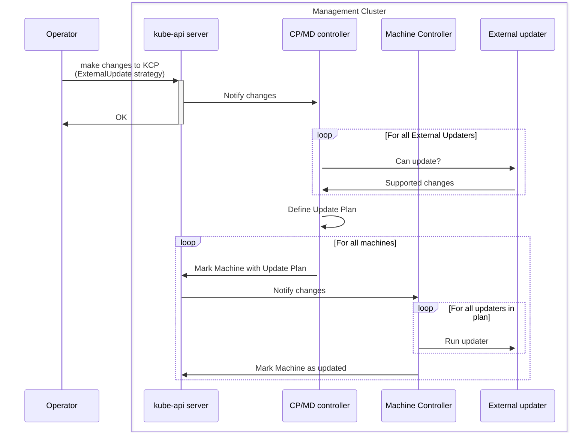
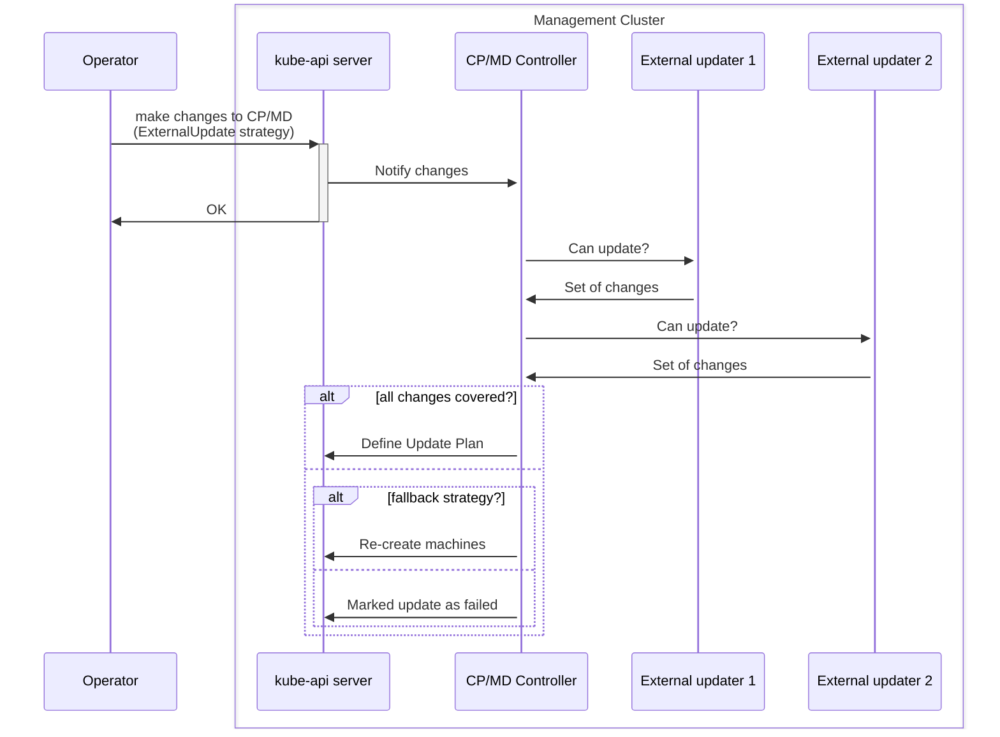
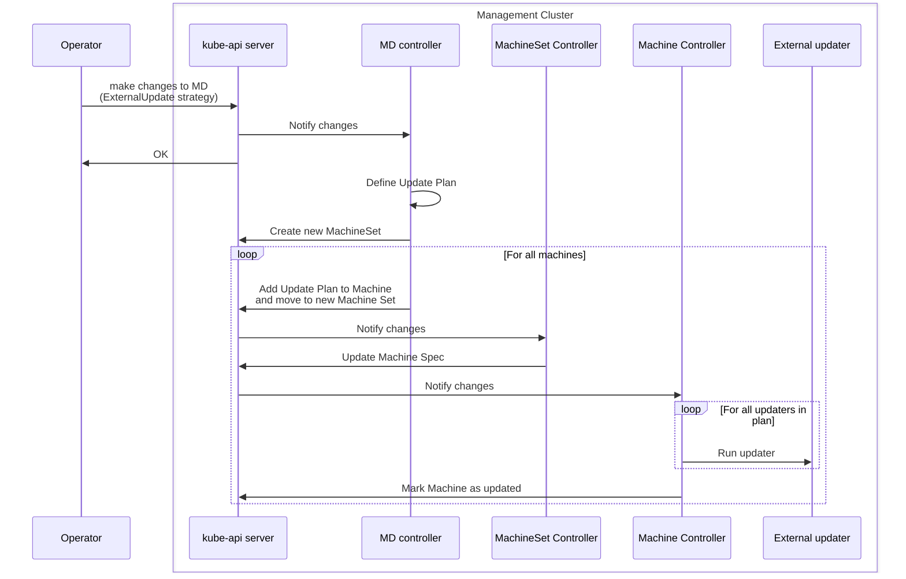
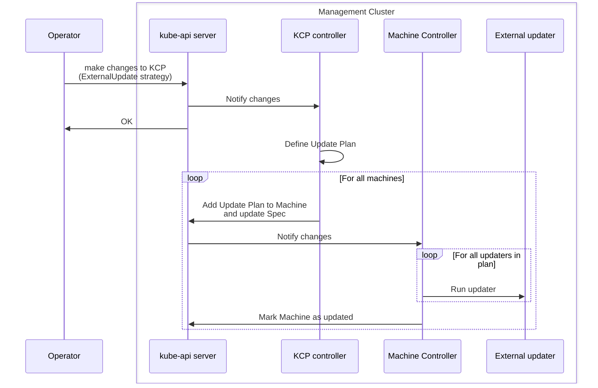
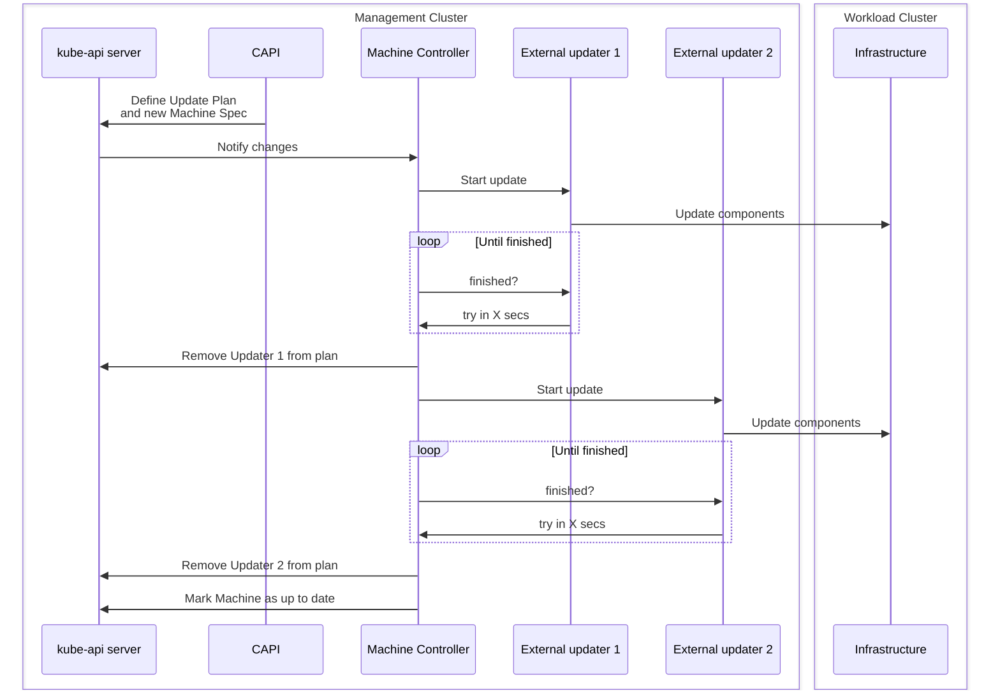
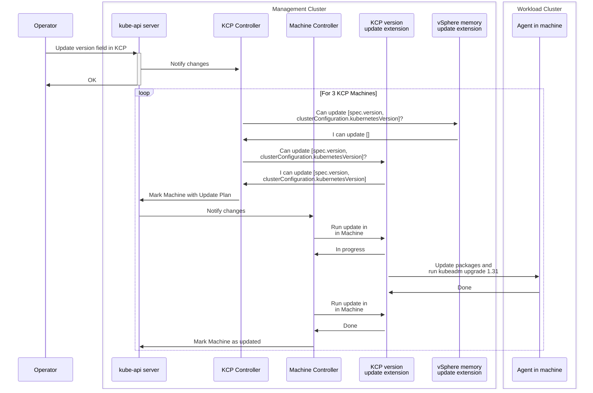
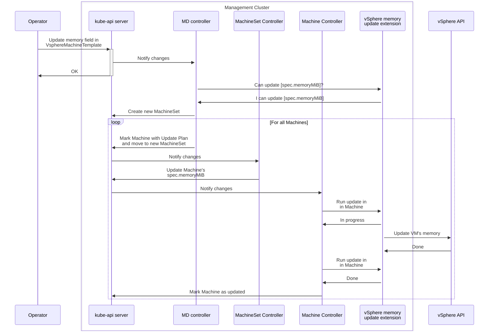
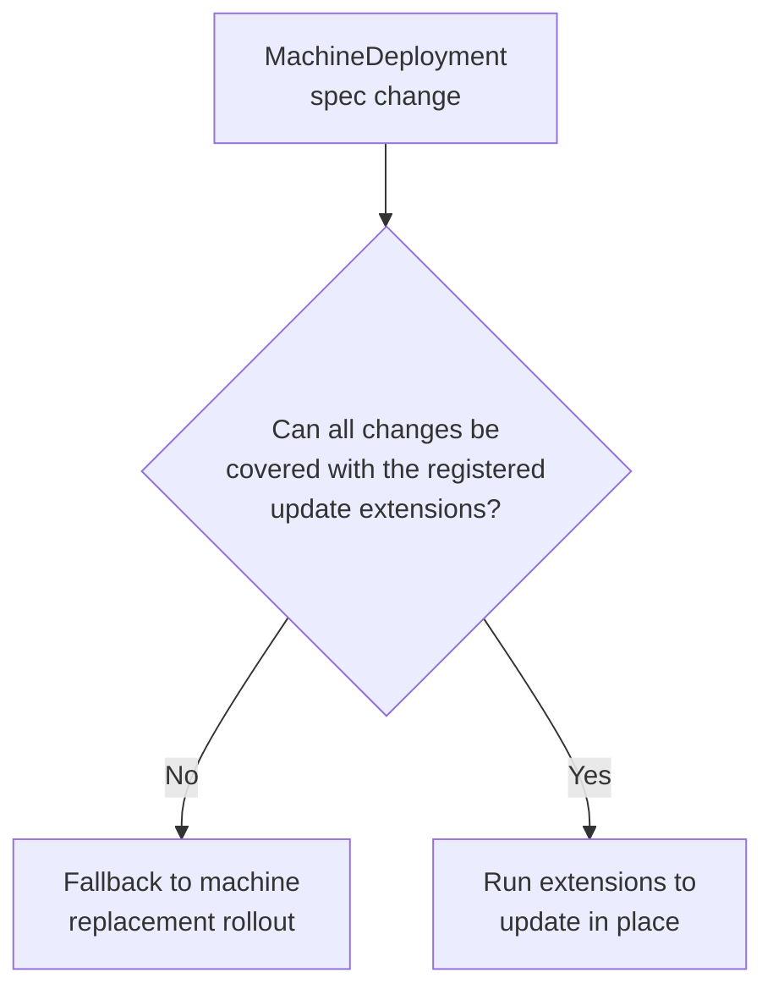
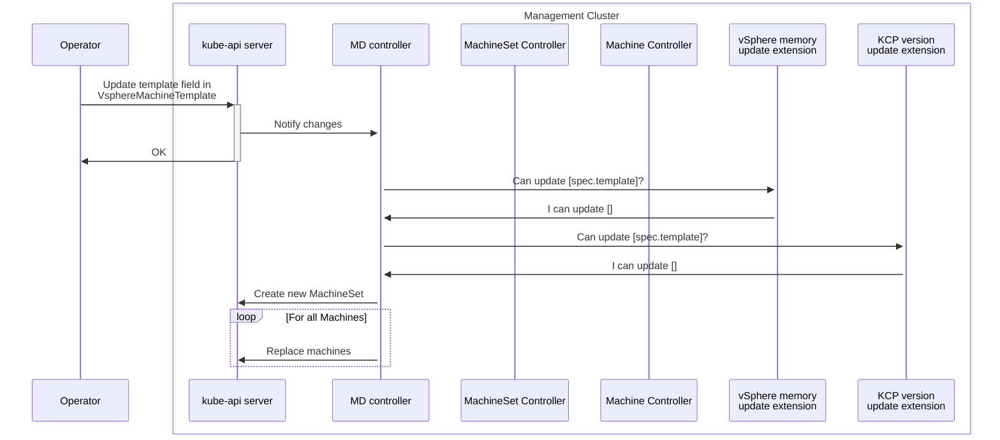

# In-place updates in Cluster API

## Table of Contents

<!-- START doctoc generated TOC please keep comment here to allow auto update -->
<!-- DON'T EDIT THIS SECTION, INSTEAD RE-RUN doctoc TO UPDATE -->

- [Glossary](#glossary)
- [Summary](#summary)
- [Motivation](#motivation)
  - [Divide and conquer](#divide-and-conquer)
  - [Tenets](#tenets)
    - [Same UX](#same-ux)
    - [Fallback to Immutable rollouts](#fallback-to-immutable-rollouts)
    - [Clean separation of concern](#clean-separation-of-concern)
  - [Goals](#goals)
  - [Non-Goals](#non-goals)
- [Proposal](#proposal)
  - [User Stories](#user-stories)
    - [Story 1](#story-1)
    - [Story 2](#story-2)
    - [Story 3](#story-3)
    - [Story 4](#story-4)
    - [Story 5](#story-5)
    - [Story 6](#story-6)
    - [Story 7](#story-7)
  - [High level flow](#high-level-flow)
  - [Defining the Update Plan](#defining-the-update-plan)
  - [MachineDeployment updates](#machinedeployment-updates)
  - [KCP updates](#kcp-updates)
  - [Machine updates](#machine-updates)
  - [Infra Machine Template changes](#infra-machine-template-changes)
  - [Remediation](#remediation)
  - [Examples](#examples)
    - [KCP kubernetes version update](#kcp-kubernetes-version-update)
    - [Update worker node memory](#update-worker-node-memory)
    - [Update worker nodes OS from Linux to Windows](#update-worker-nodes-os-from-linux-to-windows)
  - [API Changes](#api-changes)
    - [Machine](#machine)
    - [MachineDeployment](#machinedeployment)
    - [KCP](#kcp)
    - [External Update RuntimeExtension](#external-update-runtimeextension)
      - [`CanUpdateMachine` endpoint](#canupdatemachine-endpoint)
      - [Request](#request)
      - [Response](#response)
      - [`UpdateMachine` endpoint](#updatemachine-endpoint)
      - [Request](#request-1)
      - [Response](#response-1)
  - [Security Model](#security-model)
  - [Risks and Mitigations](#risks-and-mitigations)
- [Additional Details](#additional-details)
  - [Test Plan](#test-plan)
  - [Graduation Criteria](#graduation-criteria)
- [Implementation History](#implementation-history)

<!-- END doctoc generated TOC please keep comment here to allow auto update -->

## Glossary

Refer to the [Cluster API Book Glossary](https://cluster-api.sigs.k8s.io/reference/glossary.html).

__In-place Update__: any change to a Machine spec, including the Kubernetes Version, that is performed without deleting the machines and creating a new one.

__External Update Lifecycle Hook__: CAPI Lifecycle Runtime Hook to invoke external update extensions.

__External Update Extension__: Runtime Extension (Implementation) is a component responsible to perform in place updates when  the `External Update Lifecycle Hook` is invoked.

## Summary

The proposal introduces update extensions allowing users to execute custom strategies when performing Cluster API rollouts.

An External Update Extension implementing custom update strategies will report the subset of changes they know how to perform. Cluster API will orchestrate the different extensions, polling the update progress from them.

If the totality of the required changes cannot be covered by the defined extensions, Cluster API will allow to fall back to the current behavior (rolling update).

## Motivation

Cluster API by default performs rollouts by deleting a machine and creating a new one.

This approach, inspired by the principle of immutable infrastructure (the very same used by Kubernetes to manage Pods), has a set of considerable advantages:
* It is simple to explain, it is predictable, consistent and easy to reason about with users and between engineers.
* It drastically reduces the number of variables to be considered when managing the lifecycle of machines hosting nodes (it prevents each machines to become a snow flake) 
* It is simple to implement, because it relies on two core primitives only, create and delete; additionally implementation does not depend on machine specific choice, like OS, bootstrap mechanism etc.
* It allows to implement and maintain a sustainable test matrix, which is key to each Cluster API release and for the long term sustainability for the Cluster API project.

Over time several improvement were made to Cluster API immutable rollouts:
* Support for delete first strategy, thus making it easier to do immutable rollouts on bare metal / environments with constrained resources.
* Support for [In place propagation of changes affecting Kubernetes objects only](https://github.com/kubernetes-sigs/cluster-api/blob/main/docs/proposals/20221003-In-place-propagation-of-Kubernetes-objects-only-changes.md), thus avoiding unnecessary rollouts
* Support for [Taint nodes with PreferNoSchedule during rollouts](https://github.com/kubernetes-sigs/cluster-api/pull/10223), thus reducing Pod churn by optimizing how Pods are rescheduled during rollouts.

Even if the project continues to improve immutable rollouts, most probably there are and there will always be some remaining use cases where it is complex for users to perform immutable rollouts, or where users perceive immutable rollouts to be too disruptive to how they are used to manage machines in their organization:
* More efficient updates (multiple instances) that don't require re-bootstrap. Re-bootstrapping a bare metal machine takes ~10-15 mins on average. Speed matters when you have 100s - 1000s of nodes to upgrade. For a common telco RAN use case, users can have 30000-ish nodes. Depending on the parallelism, that could take days / weeks to upgrade because of the re-bootstrap time.
* Single node cluster without extra hardware available.
* `TODO: looking for more real life usecases here`

With this proposal, Cluster API provides a new extensibility point for users willing to implement their own specific solution for these problems, allowing them to implement a custom rollout strategy to be triggered via a new external update extension point implemented using the existing runtime extension framework.

With the implementation of custom rollout strategy, users can take ownership of the rollout process and embrace in-place rollout strategies, intentionally trading off some of the benefits that you get from immutable infrastructure.

### Divide and conquer

As this proposal is an output of the In-place updates Feature Group, ensuring that the external update extension allows the implementation of in-place rollout strategies is considered a non-negotiable goal of this effort.

Please note that the practical consequence of focusing on in-place rollout strategies, is that the possibility to implement different types of custom rollout strategies, even if technically possible, won’t be validated in this first iteration (future goal).

Another important point to surface, before digging into implementation details of the proposal, is the fact that this proposal is not tackling the problem of improving CAPI to embrace all the possibilities that external update extensions are introducing. E.g. If an external update extension introduces support for in-place updates, using “BootstrapConfig” (emphasis on bootstrap) as the place where most of the machine configurations are defined seems not ideal.

However, at the same time we would like to make it possible for Cluster API users to start exploring this field, gain experience, and report back so we can have concrete use cases and real-world feedback to evolve our API.

### Tenets

#### Same UX

Cluster API user experience MUST be the same when using default, immutable updates or when using external update extensions: e.g. in order to trigger a MachineDeployment rollout, you have to rotate a template, etc.

#### Fallback to Immutable rollouts

If external update extensions can not cover the totality of the desired changes, users SHOULD be able to defer to Cluster API’s default, immutable rollouts. This is important for a couple of reasons:

* It allows to implement custom rollout strategies incrementally, without the need to cover all use cases up-front.
* There are case when replacing the machine will always be necessary:
    * When it is not possible to recover the machine, e.g. hardware failure.
    * When the user determines that recovering the machine is too complex/costly vs replacing it. 
    * Automatic machine remediation (unless you use external remediation strategies)

#### Clean separation of concern

The external update extension will be responsible to perform the updates on a single machine.

The responsibility to determine which machine should be rolled out as well as the responsibility to handle rollout options like MaxSurge/MaxUnavailable will remain on the controllers owning the machine (e.g. KCP, MD controller).

### Goals

- Enable the implementation of in-place update strategies.
- Allow users to update Kubernetes clusters using pluggable External Update Extension.
- Maintain a coherent user experience for both rolling and in-place updates.
- Support External Update Extensions for both Control Plane (KCP or others) and MachineDeployment controlled machines.
- Allow in-place updates for single-node clusters without the requirement to reprovision hosts.

### Non-Goals

- To provide rollbacks in case of an in-place update failure. Failed updates need to be fixed manually by the user on the machine or by replacing the machine.

## Proposal

We propose a pluggable update strategy architecture that allows External Update Extension to handle the update process. The design decouples core CAPI controllers from the specific extension implementation responsible for updating a machine. The External Update Strategy will be configured reusing the existing field in KCP and MD resources, by introducing new type of strategy called `ExternalUpdate` (reusing the existing field in KCP and MD). This allows us to provide a consistent user experience: the interaction with the CAPI resources is the same as in rolling updates.

This proposal introduces a Lifecycle Hook named `ExternalUpdate` for communication between CAPI and external update implementers. Multiple external updaters can be registered, each of them only covering a subset of machine changes. The CAPI controllers will ask the external updaters what kind of changes they can handle and, based on the reponse, compose and orchestrate them to achieve the desired state.

### User Stories

#### Story 1

As an cluster operator, I want to perform in-place updates on my Kubernetes clusters without replacing the underlying machines. I expect the update process to be flexible, allowing me to customize the strategy based on my specific requirements, such as air-gapped environments or special node configurations.

#### Story 2

As a cluster operator, I want to seamlessly transition between rolling and in-place updates while maintaining a consistent user interface. I appreciate the option to choose or implement my own update strategy,  ensuring that the update process aligns with my organization's unique needs.

#### Story 3
As an cluster operator for resource constrained environments, I want to utilize CAPI pluggable external update mechanism to implement in-place updates without requiring additional compute capacity in a single node cluster.

#### Story 4
As an cluster operator for highly specialized/customized environments, I want to utilize CAPI pluggable external update mechanism to implement in-place updates without losing the existing VM/OS customizations.

#### Story 5
As a cluster operator, I want to update machine attributes supported by my infrastructure provider without the need to recreate the machine.

#### Story 6
As a cluster service provider, I want guidance/documentation on how to write external update extension for own my use case.

#### Story 7
As a bootstrap/controlplane provider developer, I want guidance/documentation on how to reuse some parts of this pluggable external update mechanism.

### High level flow



When configured, external updates will, roughly, follow these steps:
1. CP/MD Controller: detect an update is required.
2. CP/MD Controller: query defined update extensions, and based on the subset of changes each of them supports, defines the final update plan.
3. CP/MD Controller: mark machines for update.
4. Machine Controller: invoke all the updaters included in the plan, sequentially, one by one.
5. Machine Controller: make machine is updated.

The following sections dive deep into these steps, zooming in into the different component interactions and defining how the main error cases are handled.

### Defining the Update Plan



Both `KCP` and `MachineDeployment` controllers follow a similar pattern around updates, they first detect if an update is required and then based on the configured strategy follow the appropiate update logic (note that today there is only one valid strategy, `RollingUpdate`).

With `ExternalUpdate` strategy, CAPI controllers will compute the set of desired changes and iterate over the registered external updaters, requesting through the Runtime Hook the set of changes each updater can handle. The changes supported by an updater can be the complete set of desired changes, a subset of them or an empty set, signaling it cannot handle any of the desired changes.

On each iteration, the controller will substract from the set of desired changes the subset returned by the updater. 

If this set is reduced to zero, then CAPI will determine that the update can be performed using the external strategy. CAPI will define the update plan as a list of sequential external updaters in a particular order and proceed to execute it. The update plan will be stored in the Machine object as an array of strings (the names of the selected external updaters).

If after iterating over all external updaters the remaining set still contains uncovered changes, CAPI will determine the desired state cannot be reached through external updaters. If a fallback rolling update strategy has been configured (this is optional), CAPI will replace the machines. If no fallback strategy is configured, we will surface the issue in the resource status. Machines will remain unchanged and the desired state won't be reached unless remediated by the user. Depending on the scenario, users can: ammend the desired state to something that the registered updaters can cover, register additional updaters capable of handling the desired changes or simply enable the fallback strategy.

### MachineDeployment updates



The MachineDeployment controller updates machines in place in a very similar way to rolling updates: by creating a new MachineSet and moving the machines from the old MS to the new one. We want to stress that the Machine objects won't be deleted and recreated like in the current rolling strategy. The MachineDeployment will just update the OwnerRefs, effectively moving the existing Machine object from one MS to another. The number of machines moved at once might be made configurable on the MachineDeployment in the same way `maxSurge` and `maxUnavailable` control this for rolling updates.

When the new MachineSet controller sees a new Machine with an outdated spec, it updates the spec to match the one in the MS. This update is what triggers the Machine controller to start executing the external updaters.

> TODO: we might want the MachineDeployment to store the update plan in the MachineSet and have the MachineSet pass it down to the Machine. This should not change the high level design, so the decision will come after this first draft.

### KCP updates



The KCP external updates will work in a very similar way to MachineDeployments but removing the MachineSet level of indirection. In this case, it's the KCP controller the one in charge of both adding the update plan to the Machine and also updating the Machine spec. This follows this same pattern as for rolling updates, where the KCP controller directly creates and deletes Machines. Machines will be updates one by one, sequentially.


### Machine updates



Once a the Machine update plan is set and the Machine's spec has been updated with the desired changes, the Machine controller takes over. This controller is responsible for executing the right updaters in the right order, tracking the progress of those updaters and exposing this progress in the Machine status.

The Machine controller will follow the order in which the names of the updaters have been defined in the Machine object, executing them one by one, sequentially.

The controller will trigger updaters by hitting another RuntimeHook endpoint (eg. `/UpdateMachine`). This endpoint will take the Machine name as input. The updater could respond saying "update completed", "update failed" or "update in progress" with an optional "retry after X seconds". The CAPI controller will continuously poll the status of the update by hitting the same endpoint until it reaches a terminal state.

CAPI expects the `/UpdateMachine` endpoint of an updater to be idempotent: for the same Machine with the same spec, the endpoint can be called any number of times (before and after it completes), and the end result should be the same. CAPI guarantees that once an `/UpdateMachine` endpoint has been called once, it won't change the Machine spec until the update reaches a terminal state.

Once the update completes, the Machine controller will remove the name of the updater that has finished from the list of updaters and will start the next one. If the update fails, this will be reflected in the Machine status.

If all updaters succeed, the controller will mark the Machine as up to date and remove the update plan from the Machine.

### Infra Machine Template changes

As mentioned before, the user experience to update in-place should be the exact same one as for rolling updates. This includes the need to rotate the Infra machine template. For providers that bundle the kubernetes components in some kind of image, this means that when upgrading kubernetes versions, a new image will be required.

This might seem counter-intuitive, given the update will be made in-place, so there is no nee for a new image. However, not only this ensures the experience is the same as in rolling updates, but it also allows new Machines to be created for that MachineDeployment/CP in case a scale up or fallback to rolling is required.

We leave up to the external updater implementers to decide how to deal with these changes. Some infra providers might have the ability to swap the image in an existing running machine, in which case they can offer a true in-place update for this field. For the ones that can't do this but want to allow changes that require a new image (like kubernetes updates), they should "ignore" the image field when processing the update, leaving the machine in a dirty state.

We might explore the ability to represent this "dirty" state at the API level. We leave this for a future iteration of this feature.

### Remediation

Remediation can be used as the solution to recover machine when in-place update fails on a machine. The remediation process stays the same as today: the MachineHealthCheck controller monitors machine health status and marks it to be remediated based on pre-configured rules, then ControlPlane/MachineDeployment replaces the machine or call external remediation.

However, in-place updates might cause Nodes to become unhealthy while the update is in progress. In addition, an in-place update might take more (or less) time than a fresh machine creation. Hence, in order to successfully use MHC to remediate in-place updated Machines, we require:
* A mechanism to identify if a Machine is being updated. We will surface this in the Machine status. API details will be added later.
* A way to define different rules for Machines on-going an update. This might involve new fields in the MHC object. We will decouple these API changes from this proposal. For the first implementation of in-place updates, we might decide to just disable remediation for Machines that are on-going an update.

### Examples

This section aims to showcase our vision for the In-Places Updates end state. It shows a high level picture of a few common usecases, specially around how the different components interact through the API.

Note that these examples don't show all the low level details. In addition, some other details are subject to change, specially API fields. Some of those details might not yet be defined in this doc and will be added later, the examples here are just to help communicate the vision.

Let's imagine a vSphere cluster with a KCP control plane that has two fictional In-Place update extensions already deployed and registered through their respective `ExtensionConfig`.
1. `vsphere-vm-memory-update`: The extension uses vSphere APIs to hot-add memory to VMs if "Memory Hot Add" is enabled or through a power cycle.
1. `kcp-version-upgrade`: Updates the kubernetes version of KCP machines by using an agent that first updates the kubernetes related packages (`kubeadm`, `kubectl`, etc.) and then runs the `kubeadm upgrade` command. The In-place Update extension communicates with this agent, sending instructions with the kubernetes version a machine needs to be update to.


#### KCP kubernetes version update



The user starts the process by updating the version field in the KCP object:

```diff
apiVersion: controlplane.cluster.x-k8s.io/v1beta1
kind: KubeadmControlPlane
metadata:
  name: kcp-1
spec:
  replicas: 3
  rolloutStrategy:
    type: InPlace
- version: v1.30.0
+ version: v1.31.0
```

The KCP computes the difference between the current CP machines (plus bootstrap config and infra machine) and their desired state and detecs a difference for the machine `spec.version` and for the KubeadmConfig `spec.clusterConfiguration.kubernetesVersion`. It then start to construct an update plan.

First, it makes a request to the `vsphere-vm-memory-update/CanUpdateMachine` endpoint of the first update extension registered, the `vsphere-vm-memory-update` exstension:

```json
{
    "desiredMachine": {...},
    "desiredBootstrapConfig": {...},
    "desiredInfraMachine": {...},
    "changes": ["machine.spec.version", "bootstrap.spec.clusterConfiguration.kubernetesVersion"],
}
```

The `vsphere-vm-memory-update` extension does not support any or the required changes, so it responds with the following message declaring that if does not accept any of the requrested changes:

```json
{
    "error": null,
    "acceptedChanges": [],
}
```

Given the there are still changes not covered, KCP continues with the next update extension, making the same request to the `kcp-version-upgrade/CanUpdateMachine` endpoint of the `kcp-version-upgrade` extension:


```json
{
    "desiredMachine": {...},
    "desiredBootstrapConfig": {...},
    "desiredInfraMachine": {...},
    "changes": ["machine.spec.version", "bootstrap.spec.clusterConfiguration.kubernetesVersion"],
}
```

The `kcp-version-upgrade` extension detects that this is a KCP machine, verifies that the changes only require a kubernetes version upgrade, and responds:

```json
{
    "error": null,
    "acceptedChanges": ["machine.spec.version", "bootstrap.spec.clusterConfiguration.kubernetesVersion"],
}
```

Now that the KCP knows how to cover all desired changes, it proceeds to mark the first selected KCP machine for update. It sets the `updaters` field, which is the signal for the Machine controller to treat this changes differently (as an external update).

```diff
apiVersion: cluster.x-k8s.io/v1beta1
kind: Machine
metadata:
  name: kcp-1-hfg374h
spec:
- version: v1.30.0
+ version: v1.31.0
  bootstrap:
    configRef:
      apiVersion: bootstrap.cluster.x-k8s.io/v1beta1
      kind: KubeadmConfig
-     name: kcp-1-hfg374h-9wc29
-     uid: fc69d363-272a-4b91-aa35-72ccdaa7a427
+     name: kcp-1-hfg374h-flkf3
+     uid: ddab8525-bb36-4a86-81e9-ef3eeeb33e18
+  updaters:
+  - kcp-version-upgrade
```

These changes are observed by the Machine controller, which marks the machine as not up to date:

```diff
apiVersion: cluster.x-k8s.io/v1beta1
kind: Machine
metadata:
  name: kcp-1-hfg374h
spec:
  version: v1.31.0
  bootstrap:
    configRef:
      apiVersion: bootstrap.cluster.x-k8s.io/v1beta1
      kind: KubeadmConfig
      name: kcp-1-hfg374h-flkf3
      uid: ddab8525-bb36-4a86-81e9-ef3eeeb33e18
   updaters:
   - kcp-version-upgrade
status:
  conditions:
+ - lastTransitionTime: "2024-12-31T23:50:00Z"
+   status: "False"
+   type: UpToDate

```

Then it executes all updaters in order (in this case only one). To trigger the updater, it calls the `kcp-version-upgrade/UpdateMachine` endpoint:

```json
{
    "machine": {
        "name": "kcp-1-hfg374h",
        "namespace": "default",
    }
}
```

When the `kcp-version-upgrade` extension receives the request, it verifies it read the Machine object, verifies it's a CP machine and triggers the upgrade process by sending the order to the agent. It then responds to the Machine controller:

```json
{
    "error": null,
    "status": "InProgress",
    "tryAgain": "5m0s"
}
```

The Machine controller then requeues the reconcile request for this Machine for 5 minutes later. On the next reconciliation, it detects that the Machine still has one updater in its spec, so it repeats the request to the `kcp-version-upgrade/UpdateMachine` endpoint:

```json
{
    "machine": {
        "name": "kcp-1-hfg374h",
        "namespace": "default",
    }
}
```

The `kcp-version-upgrade` which has tracked the upgrade process reported by the agent, responds:

```json
{
    "error": null,
    "status": "Done"
}
```

The Machine controller then removes the updater from the spec and marks the machine as up to date:

```diff
apiVersion: cluster.x-k8s.io/v1beta1
kind: Machine
metadata:
  name: kcp-1-hfg374h
spec:
  version: v1.31.0
  bootstrap:
    configRef:
      apiVersion: bootstrap.cluster.x-k8s.io/v1beta1
      kind: KubeadmConfig
      name: kcp-1-hfg374h-flkf3
      uid: ddab8525-bb36-4a86-81e9-ef3eeeb33e18
-  updaters:
-  - kcp-version-upgrade
status:
  conditions:
- - lastTransitionTime: "2024-12-31T23:50:00Z"
-   status: "False"
+ - lastTransitionTime: "2024-12-31T23:59:59Z"
+   status: "True"
    type: UpToDate
```

On the next KCP reconciliation, it detects that this machine doesn't differ anymore from the desired state, picking the next and repeating the same process.

This process is repeated a third time with the last KCP machine, finally marking the KCP object as up to date.

#### Update worker node memory



The user starts the process by creating a new VSphereMachineTemplate with the updated `memoryMiB` value and updating the infrastructure template ref in the MachineDeployment:

```diff
apiVersion: infrastructure.cluster.x-k8s.io/v1beta1
kind: VSphereMachineTemplate
metadata:
  name: md-1-2
spec:
  template:
    spec:
-     memoryMiB: 4096
+     memoryMiB: 8192
```

```diff
apiVersion: cluster.x-k8s.io/v1beta1
kind: MachineDeployment
metadata:
  name: m-cluster-vsphere-gaslor-md-0
spec:
  strategy:
    type: InPlace
  template:
    spec:
      infrastructureRef:
        apiVersion: infrastructure.cluster.x-k8s.io/v1beta1
        kind: VSphereMachineTemplate
-       name: md-1-1
+       name: md-1-2
```

The `vsphere-vm-memory-update` extension informs that can cover all requested changes:

```json
{
    "desiredMachine": {...},
    "desiredBootstrapConfig": {...},
    "desiredInfraMachine": {...},
    "changes": ["infraMachine.spec.memoryMiB"],
}
```

```json
{
    "error": null,
    "acceptedChanges": ["infraMachine.spec.memoryMiB"],
}
```

There is no need to continue with the `kcp-version-upgrade` since all covers are already covered, which completes the update plan.

The Machine controller then creates a new MachineSet with the new spec and moves the first Machine to it by updating its `OwnerRefs`:

```diff
apiVersion: cluster.x-k8s.io/v1beta1
kind: Machine
metadata:
  name: md-1-6bp6g
  ownerReferences:
  - apiVersion: cluster.x-k8s.io/v1beta1
    kind: MachineSet
-   name: md-1-gfsnp
+   name: md-1-hndio
```

The MachineSet controller detects that this machine is out of date and proceeds to update the Machine's spec:

```diff
apiVersion: cluster.x-k8s.io/v1beta1
kind: Machine
metadata:
  name: md-1-6bp6g
spec:
  infrastructureRef:
    apiVersion: infrastructure.cluster.x-k8s.io/v1beta1
    kind: VSphereMachine
-   name: md-1-1-whtwq
+   name: md-1-2-nfdol
```

From that point, the Machine controller follows the same process as in the first example.

The process is repeated for all replicas in the MachineDeployment.

#### Update worker nodes OS from Linux to Windows





The user starts the process by creating a new VSphereMachineTemplate with the updated `template` value and updating the infrastructure template ref in the MachineDeployment:

```diff
apiVersion: infrastructure.cluster.x-k8s.io/v1beta1
kind: VSphereMachineTemplate
metadata:
  name: md-1-3
spec:
  template:
    spec:
-     template: /Datacenter/vm/Templates/kubernetes-1-32-ubuntu
+     template: /Datacenter/vm/Templates/kubernetes-1-32-windows
```

```diff
apiVersion: cluster.x-k8s.io/v1beta1
kind: MachineDeployment
metadata:
  name: m-cluster-vsphere-gaslor-md-0
spec:
  strategy:
    type: InPlace
    fallbackRollingUpdate:
      maxUnavailable: 1
  template:
    spec:
      infrastructureRef:
        apiVersion: infrastructure.cluster.x-k8s.io/v1beta1
        kind: VSphereMachineTemplate
-       name: md-1-2
+       name: md-1-3
```

Both the `kcp-version-upgrade` and the `vsphere-vm-memory-update` extensions informs that they cannot handle any of the changes:

```json
{
    "desiredMachine": {...},
    "desiredBootstrapConfig": {...},
    "desiredInfraMachine": {...},
    "changes": ["infraMachine.spec.template"],
}
```

```json
{
    "error": null,
    "acceptedChanges": [],
}
```

Since the fallback to machine replacement is enabled, the MachineDeployment controller proceeds with the rollout process as it does today, replacing the old machines with new ones.

### API Changes

#### Machine

> TODO: we will add this later, after we get feedback from the first daft
> >
> Requirements:
>
> * Can store the update plan: array of strings
> * Can indicate a Machine is up to date or not and if it's on-going an update.

#### MachineDeployment

> TODO: we will add this later, after we get feedback from the first daft
> >
> Requirements:
>
> * Can configure external as the rollout strategy
> * Can configure rolling as the fallback strategy when external strategy is selected

#### KCP

> TODO: we will add this later, after we get feedback from the first daft
> >
> Requirements:
>
> * Can configure external as the rollout strategy
> * Can configure rolling as the fallback strategy when external strategy is selected

#### External Update RuntimeExtension

> TODO: we will add this later, after we get feedback from the first daft

##### `CanUpdateMachine` endpoint
##### Request
> Requirements:
> * Current Machine Spec
> * Desired Machine Spec, including bootstrap and and infra machine templates

##### Response
> Requirements:
> * Set of supported changes, probably and array of strings (the path in the object)
> * Error

##### `UpdateMachine` endpoint
##### Request
> Requirements:
> * Machine reference

##### Response
> Requirements:
> * Result: [Success/Error/InProgress]
> * Retry in X seconds

### Security Model

On the core CAPI side, the security model for this feature is very straightforward: CAPI controllers only require to read/create/update CAPI resources and those controllers are the only ones that need to modify the CAPI resources. Moreover, the controllers that need to perform these actions already have the necessary permissions over the resources they need to modify.

However, each external updater should define their own security model. Depending on the mechanism used to update machines in-place, different privileges might be needed, from scheduling privileged pods to SSH access to the hosts. Moreover, external updaters  might need RBAC to read CAPI resources.

### Risks and Mitigations

1. One of the risks for this process could be that during a single node cluster in-place update, extension implementation might decline the update and that would result in falling back to rolling update strategy, which could lead to breaking a cluster if not using the feature as intended (allowing fallback strategy for this specific case). Good documentation with examples can be provided to avoid such scenarios.

## Additional Details

### Test Plan

To test the external update strategy, we will implement a "CAPD Kubeadm Updater". This will serve as a reference implementation and will be integrated into CAPI CI. In-place updates will be performed by executing a set of commands in the container, similar to how it is currently implemented for cloud config when machine is bootstrapped.

### Graduation Criteria

The initial plan is to provide support for external update strategy in the KCP and MD controllers under a feature flag (which would be unset by default) and to have the webhook API in an `alpha` stage )which will allow us to iterate faster).

The main criteria for graduating this feature will be community adoption and API stability. Once the feature is stable, we have fixes to any known bugs and the webhook API has remained stable without backward incompatible changes for some time, we will propose to the community moving the API out of the `alpha` stage.

## Implementation History

- [ ] MM/DD/YYYY: Proposed idea in an issue or [community meeting]
- [ ] MM/DD/YYYY: Compile a Google Doc following the CAEP template (link here)
- [ ] MM/DD/YYYY: First round of feedback from community
- [ ] MM/DD/YYYY: Present proposal at a [community meeting]
- [ ] MM/DD/YYYY: Open proposal PR

<!-- Links -->
[community meeting]: https://docs.google.com/document/d/1ushaVqAKYnZ2VN_aa3GyKlS4kEd6bSug13xaXOakAQI/edit#heading=h.pxsq37pzkbdq
