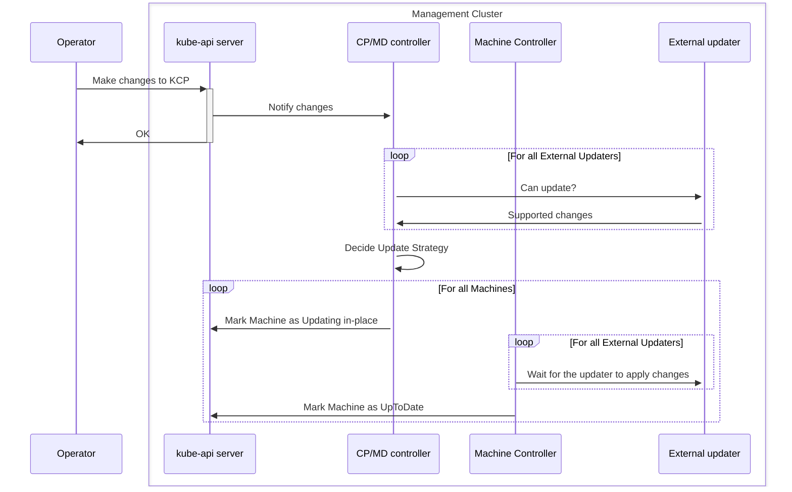
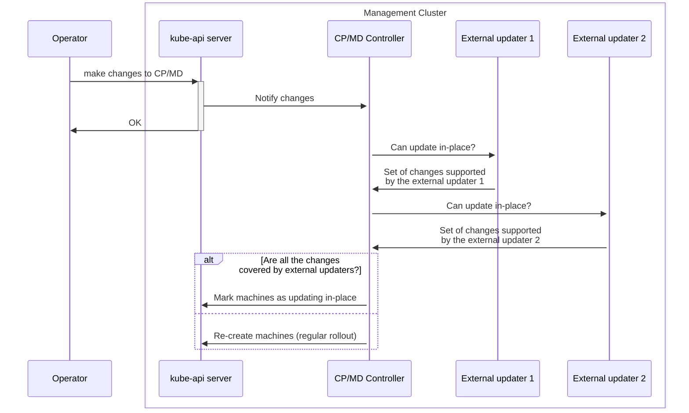
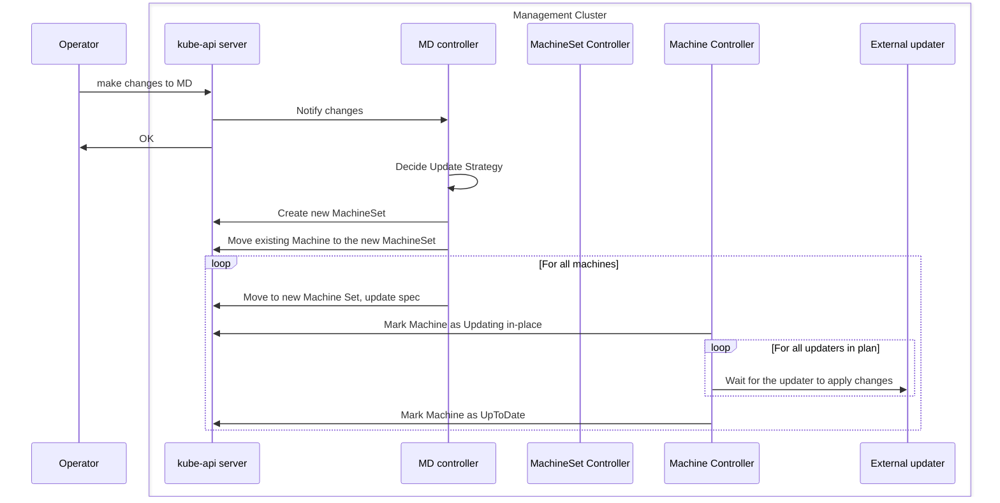
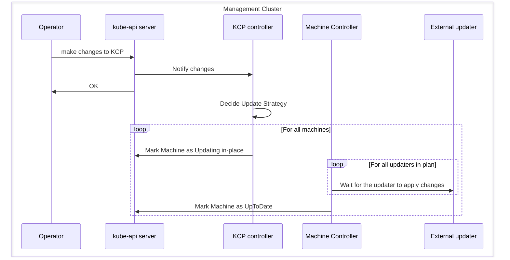
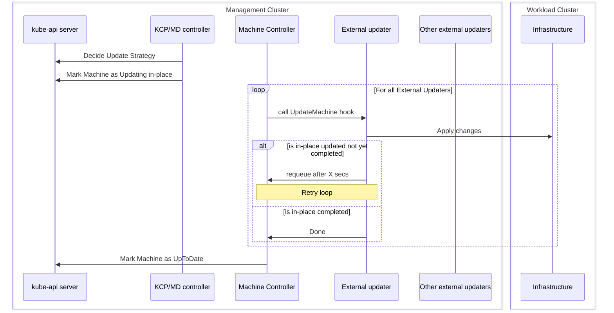

# In-place updates in Cluster API

## Table of Contents

<!-- START doctoc generated TOC please keep comment here to allow auto update -->
<!-- DON'T EDIT THIS SECTION, INSTEAD RE-RUN doctoc TO UPDATE -->

- [Glossary](#glossary)
- [Summary](#summary)
- [Motivation](#motivation)
  - [Divide and conquer](#divide-and-conquer)
  - [Tenets](#tenets)
    - [Same UX](#same-ux)
    - [Fallback to Immutable rollouts](#fallback-to-immutable-rollouts)
    - [Clean separation of concern](#clean-separation-of-concern)
  - [Goals](#goals)
  - [Non-Goals/Future work](#non-goalsfuture-work)
- [Proposal](#proposal)
  - [User Stories](#user-stories)
    - [Story 1](#story-1)
    - [Story 2](#story-2)
    - [Story 3](#story-3)
    - [Story 4](#story-4)
    - [Story 5](#story-5)
    - [Story 6](#story-6)
  - [High level flow](#high-level-flow)
  - [Deciding the update strategy](#deciding-the-update-strategy)
  - [MachineDeployment updates](#machinedeployment-updates)
  - [KCP updates](#kcp-updates)
  - [Machine updates](#machine-updates)
  - [Infra Machine Template changes](#infra-machine-template-changes)
  - [Remediation](#remediation)
  - [Examples](#examples)
    - [KCP kubernetes version update](#kcp-kubernetes-version-update)
    - [Update worker node memory](#update-worker-node-memory)
    - [Update worker nodes OS from Linux to Windows](#update-worker-nodes-os-from-linux-to-windows)
  - [Security Model](#security-model)
  - [Risks and Mitigations](#risks-and-mitigations)
- [Additional Details](#additional-details)
  - [Test Plan](#test-plan)
  - [Graduation Criteria](#graduation-criteria)
- [Implementation History](#implementation-history)

<!-- END doctoc generated TOC please keep comment here to allow auto update -->

## Glossary

Refer to the [Cluster API Book Glossary](https://cluster-api.sigs.k8s.io/reference/glossary.html).

__In-place Update__: any change to a Machine spec, including the Kubernetes Version, that is performed without deleting the machines and creating a new one.

__Update Lifecycle Hook__: CAPI Lifecycle Runtime Hook to invoke external update extensions.

__Update Extension__: Runtime Extension (Implementation) is a component responsible to perform in-place updates when  the `External Update Lifecycle Hook` is invoked.

## Summary

The proposal introduces update extensions allowing users to execute changes on existing machines without deleting the machines and creating a new one.

An External Update Extension will report the subset of changes they know how to perform. Cluster API will orchestrate the different extensions, polling the update progress from them.

If the totality of the required changes cannot be covered by the defined extensions, Cluster API will fall back to the current behavior (rolling update).

## Motivation

Cluster API by default performs rollouts by creating a new machine and deleting the old one.

This approach, inspired by the principle of immutable infrastructure (the very same used by Kubernetes to manage Pods), has a set of considerable advantages:
* It is simple to explain, it is predictable, consistent and easy to reason about with users and between engineers.
* It drastically reduces the number of variables to be considered when managing the lifecycle of machines hosting nodes (it prevents each machines to become a snow flake) 
* It is simple to implement, because it relies on two core primitives only, create and delete; additionally implementation does not depend on machine specific choice, like OS, bootstrap mechanism etc.
* It allows to implement and maintain a sustainable test matrix, which is key to each Cluster API release and for the long term sustainability for the Cluster API project.

Over time several improvement were made to Cluster API immutable rollouts:
* Support for delete first strategy, thus making it easier to do immutable rollouts on bare metal / environments with constrained resources.
* Support for [In-place propagation of changes affecting Kubernetes objects only](https://github.com/kubernetes-sigs/cluster-api/blob/main/docs/proposals/20221003-In-place-propagation-of-Kubernetes-objects-only-changes.md), thus avoiding unnecessary rollouts
* Support for [Taint nodes with PreferNoSchedule during rollouts](https://github.com/kubernetes-sigs/cluster-api/pull/10223), thus reducing Pod churn by optimizing how Pods are rescheduled during rollouts.

Even if the project continues to improve immutable rollouts, most probably there are and there will always be some remaining use cases where it is complex for users to perform immutable rollouts, or where users perceive immutable rollouts to be too disruptive to how they are used to manage machines in their organization:
* More efficient updates (multiple instances) that don't require re-bootstrap. Re-bootstrapping a bare metal machine takes ~10-15 mins on average. Speed matters when you have 100s - 1000s of nodes to update. For a common telco RAN use case, users can have 30000-ish nodes. Depending on the parallelism, that could take days / weeks to update because of the re-bootstrap time.
* Credentials rotation, e.g. rotating authorized keys for SSH.
* Database workloads that use local storage and rely on application-level replication—rather than storage-level replication—can face significant downtime if recloning is required. In such cases, restoring a database may take hours and disrupt business continuity, compared to a simple reboot that takes just minutes (e.g. PostgreSQL clusters managed by CloudNativePG using local persistent volumes with storage classes like OpenEBS or TopoLVM).

With this proposal, Cluster API provides a new extensibility point for users willing to implement their own specific solution for these problems by implementing an Update extension.

With the implementation of an Update extension, users can take ownership of the rollout process and embrace in-place rollout strategies, intentionally trading off some of the benefits that you get from immutable infrastructure.

### Divide and conquer

Considering the complexity of this topic, a phased approach is required to design and implement the solution for in-place updates.

The main goal of the first iteration of this proposal is to make it possible for Cluster API users to start experimenting usage of in-place updates, so we can gather feedback and evolve to the next stage.

This iteration will focus on implementing the machinery required to interact with update extensions, while users facing changes in the API types are deferred to follow up iterations.

### Tenets

#### Same UX

Cluster API user experience MUST be the same when using default, immutable updates or when using external update extensions: e.g. in order to trigger a MachineDeployment rollout, you have to rotate a template, etc.

Notably, this point has another relevant implication: users should care ONLY about the desired state, while Cluster API is responsible to choose
the best strategy to achieve desired state.

This proposal, with the introduction of update extensions, expands the set of tools Cluster API can use to achieve the desired state.

#### Fallback to Immutable rollouts

If external update extensions can not cover the totality of the desired changes, CAPI will defer to Cluster API’s default, immutable rollouts. This is important for a couple of reasons:

* It allows to implement in-place update capabilities incrementally, without the need to cover all use cases up-front.
* There are cases when replacing the machine will always be necessary:
    * When it is not possible to recover the machine, e.g. hardware failure.
    * When the user determines that recovering the machine is too complex/costly vs replacing it. 
    * Automatic machine remediation (unless you use external remediation strategies)

#### Clean separation of concern

It is the responsibility of the extension to decide if it can perform changes in-place and to perform these changes on a control plane single Machine
and/or to all the Machines controlled by a MachineSet.

The responsibility to determine which Machine/MachineSet should be updated, the responsibility to handle CAPI resources during in-place update or immutable rollouts as well as the responsibility to handle rollout options like MaxSurge/MaxUnavailable will remain on the controllers owning the machine (e.g. KCP, MD controller).

### Goals

- Enable the implementation of pluggable update extensions.
- Allow users to update Kubernetes clusters using pluggable External Update Extension.
- Support External Update Extensions for both Control Plane (KCP or others) and MachineDeployment controlled machines.

### Non-Goals/Future work

- To provide rollbacks in case of an in-place update failure. Failed updates need to be fixed manually by the user on the machine or by replacing the machine.
- Introduce any API changes both in core Cluster API or in KCP (or any other control plane provider).
- Support more than one pluggable update extensions (future goal).
- Allow in-place updates for single-node clusters without the requirement to reprovision hosts (future goal).

## Proposal

We propose to extend KCP and MachineDeployment rollout workflows to call External Update Extensions, if defined.

Initially, this feature will be implemented without making API changes in the current core Cluster API objects. It will follow Kubernetes' feature gate mechanism. All functionality related to in-place Updates will be available only if the `InPlaceUpdates` feature flag is set to true. It is disabled unless explicitly configured.

This proposal introduces three new Lifecycle Hooks named `CanUpdateMachine`, `CanUpdateMachineSet` and `UpdateMachine` for communication between CAPI and external update implementers. 

Multiple external updaters can be registered, each of them only covering a subset of machine changes (*). The CAPI controllers will ask the external updaters what kind of changes they can handle and, based on the response, compose and orchestrate them to achieve the desired state.

With the introduction of this experimental feature, users may want to apply the in-place updates workflow to a subset of CAPI clusters only. By leveraging CAPI's `RuntimeExtension`, we can provide a namespace selector via [`ExtensionConfig`](https://cluster-api.sigs.k8s.io/tasks/experimental-features/runtime-sdk/implement-extensions#extensionconfig). This allows us to support cluster selection at the namespace level (only clusters/machines namespaces that match the selector) without applying API changes.

(*) In the first iteration the number of external updaters will be limited to one.

### User Stories

#### Story 1

As a cluster operator, I want to perform in-place updates on my Kubernetes clusters without replacing the underlying machines. I expect the update process to be flexible and customizable based on specific requirements, such as air-gapped environments or special node configurations.

#### Story 2

As a cluster operator, I want to seamlessly transition between rolling and in-place updates while maintaining a consistent user interface. I appreciate the option to extend the rollout process with in-place update capabilities, ensuring that the update process aligns with my organization's unique needs.

#### Story 3
As a cluster operator for resource constrained environments, I want to utilize CAPI pluggable external update mechanism to implement in-place updates without requiring additional compute capacity in a single node cluster.

#### Story 4
As a cluster operator for highly specialized/customized environments, I want to utilize CAPI pluggable external update mechanism to implement in-place updates without losing the existing VM/OS customizations.

#### Story 5
As a cluster operator, I want to update machine attributes supported by my infrastructure provider without the need to recreate the machine.

#### Story 6
As a cluster service provider, I want guidance/documentation on how to write external update extension for my own use case.

### High level flow



When configured, external updates will, roughly, follow these steps:
1. CP/MD Controller: detect an update is required.
2. CP/MD Controller: query defined update extensions, and based on the response decides if an update should happen in-place. If not, the update will be performed as of today (rollout).
3. CP/MD Controller: mark machines as updating in-place.
4. Machine Controller: invoke all registered updaters, sequentially, one by one.
5. Machine Controller: once updaters finish Mark Machine as UpToDate.

The following sections dive deep into these steps, zooming in into the different component interactions and defining how the main error cases are handled.

### Deciding the update strategy



Both `KCP` and `MachineDeployment` controllers follow a similar pattern around updates; as a first step they detect if an update is required.

With `InPlaceUpdates` feature gate enabled, CAPI controllers will go through the "can update in-place" decision flow: 

As a first step, CAPI controllers will compute the set of desired changes (current and desired state).

Then CAPI controllers will iterate over the registered external updaters, requesting each updater if it can handle required changes through the `CanUpdateMachineSet` (MachineDeployment) and `CanUpdateMachine` (KCP).

The changes supported by an updater can be the complete set of desired changes, a subset of them or an empty set, signaling it cannot handle any of the desired changes.

If the combination of the updaters can handle ALL the desired changes then CAPI will determine that the update can be performed in-place. 

If ANY of the desired changes cannot be covered by the updaters capabilities, CAPI will determine the desired state cannot be reached through external updaters. In this case, it will fallback to the rolling update strategy, replacing machines as needed. 

### MachineDeployment updates

The MachineDeployment update should take care of:
- The internal implementation details of MachineDeployments, or more specifically of the intermediate layer MachineSet that controls Machines.
- The MaxUnavailability and MaxSurge constraint that exist to protect user workloads.

In order to do so:
- The "can update in-place" decision is performed at MachineSet level by calling the `CanUpdateMachineSet` hook.
- Before starting an in-place update, a Machine is moved from the current MachineSet (with the old spec) to
  the MachineSet with the new spec; during this step also the Machine/InfraMachine/BootstrapConfig are updated 
  to the new spec.
- Machines updating in-place are considered not available, because in-place updates are always considered as potentially disruptive.
  - If maxUnavailable is zero, a new machine must be created first, then as soon as there is “buffer” for in-place, in-place update can proceed



Please note that:
- When in-place is possible, the system should try to in-place update as many machines as possible.
  In practice, this means that maxSurge might be not fully used (it is used only for scale up by one if maxUnavailable=0)
- No in-place updates are performed when using rollout strategy on delete.

Please refer to [implementation note](./20240807-in-place-updates-implementation-notes.md) for more details about how the move operation is performed.

### KCP updates
The KCP external updates will work in a very similar way to MachineDeployments but removing the MachineSet level of indirection. 

In order to do so:
- The "can update in-place" decision is performed at MachineSet level by calling the `CanUpdateMachine` hook.
- Before starting an in-place update, the Machine/InfraMachine/BootstrapConfig are updated
  to the new spec.
- If maxSurge is one, a new machine must be created first, then as soon as there is “buffer” for in-place, in-place update can proceed.
- If maxSurge is zero, in-place update can proceed immediately.
- Note: to better understand above points, you might want to consider that maxSurge in KCP is a way to express if the 
  control plane rollout should be performed "scaling-out" or "scaling-in"
- Note: KCP has its own definition of availability, that is preserved during a rollout no matter of it is performed using
  in-place updates or regular rollouts.

Notably, while KCP will always try to perform in-place whenever possible, KCP might decide to not perform in-place
changes when it determines that this might impact the control-plane health.



Please refer to [implementation note](./20240807-in-place-updates-implementation-notes.md) for more details about how KCP handles in-place updates.

### Machine updates

Once a Machine is marked as `Updating` in-place and the Machine's spec has been updated with the desired changes, the Machine controller takes over. This controller is responsible for calling the updaters and tracking the progress of those updaters and exposing this progress in the Machine conditions.

The Machine controller currently calls only one updater (we are explicitly not trying to design a solution for ordering of execution at this stage. However, determining a specific ordering mechanism or dependency management between update extensions will need to be addressed in future iterations of this proposal).

The controller will trigger updaters by calling the `UpdateMachine` hook. The updater could respond saying "update completed", "update failed" or "update in progress" with an optional "retry after X seconds". The CAPI controller will continuously poll the status of the update by hitting the same endpoint until the operation reports "update completed" or "update failed".

CAPI expects the `UpdateMachine` endpoint of an updater to be idempotent: for the same Machine with the same spec, the endpoint can be called any number of times (before and after it completes), and the end result should be the same. CAPI guarantees that once an `UpdateMachine` endpoint has been called once, it won't change the Machine spec until the update either completes or fails.

Once all of the updaters are complete, the Machine controller will mark machine as `UpToDate`. If the update fails, this will be reflected in the Machine status.



Please refer to [implementation note](./20240807-in-place-updates-implementation-notes.md) for more details about how managedFields management has been improved for allowing in-place updates (both for KCP and MS).

### Infra Machine Template changes

As mentioned before, the user experience to update in-place should be the exact same one as for rolling updates. This includes the need to rotate the Infra machine template. For providers that bundle the kubernetes components in some kind of image, this means that when upgrading kubernetes versions, a new image will be required.

This might seem counter-intuitive, given the update will be made in-place, so there is no need for a new image. However, not only this ensures the experience is the same as in rolling updates, but it also allows new Machines to be created for that MachineDeployment/CP in case a scale up is required or fallback to rolling update.

We leave up to the external updater implementers to decide how to deal with these changes. Some infra providers might have the ability to swap the image in an existing running machine, in which case they can offer a true in-place update for this field. For the ones that can't do this but want to allow changes that require a new image (like kubernetes updates), they should "ignore" the image field when processing the update, leaving the machine in a dirty state.

We might explore the ability to represent this "dirty" state at the API level. We leave this for a future iteration of this feature.

### Remediation

Remediation can be used as the solution to recover machine when in-place update fails on a machine. The remediation process stays the same as today: the MachineHealthCheck controller monitors machine health status and marks it to be remediated based on pre-configured rules, then ControlPlane/MachineDeployment replaces the machine or call external remediation.

However, in-place updates might cause Nodes to become unhealthy while the update is in progress. In addition, an in-place update might take more (or less) time than a fresh machine creation. Hence, in order to successfully use MHC to remediate in-place updated Machines, in a future iteration of this proposal we will consider:
* A mechanism to identify if a Machine is being updated. We will surface this in the Machine status. API details will be added later.
* A way to define different rules for Machines on-going an update. This might involve new fields in the MHC object. We will decouple these API changes from this proposal. For the first implementation of in-place updates, we might decide to just disable remediation for Machines that are on-going an update.

### Examples

This section aims to showcase our vision for the in-place update end state. It shows a high level picture of a few common use cases, specially around how the different components interact through the API.

Note that these examples don't show all the low level details, the examples here are just to help communicate the vision.

Let's imagine a vSphere cluster with a KCP control plane that has two fictional in-place update extensions already deployed and registered through their respective `ExtensionConfig`.
1. `vsphere-vm-memory-update`: The extension uses vSphere APIs to hot-add memory to VMs if "Memory Hot Add" is enabled or through a power cycle.
2. `kcp-version-update`: Updates the kubernetes version of KCP machines by using an agent that first updates the kubernetes related packages (`kubeadm`, `kubectl`, etc.) and then runs the `kubeadm upgrade` command. The In-place Update extension communicates with this agent, sending instructions with the kubernetes version a machine needs to be updated to.

#### KCP kubernetes version update

The user starts the process by updating the version field in the KCP object:

```diff
apiVersion: controlplane.cluster.x-k8s.io/v1beta1
kind: KubeadmControlPlane
metadata:
  name: kcp-1
spec:
  replicas: 3
- version: v1.30.0
+ version: v1.31.0
```

The KCP computes the difference between the current CP machines (plus bootstrap config and infra machine) and their desired state and detects a difference for the machine `spec.version` and for the KubeadmConfig `spec.clusterConfiguration.kubernetesVersion`. It then starts calling the external update extensions to see if they can handle these changes.

First, it makes a request to the `vsphere-vm-memory-update/CanUpdateMachine` endpoint of the one of update extension registered, the `vsphere-vm-memory-update` extension in this case:

```json
{
    "current": {
      "machine": { ... },
      "infrastructureMachine": { ... },
      "bootstrapConfig": { ... },
    },
    "desired": {
      "machine": { ... },
      "infrastructureMachine": { ... },
      "bootstrapConfig": { ... },
    }
}
```

At this stage, the difference between current and desired will be the change applied by the user.

The `vsphere-vm-memory-update` extension does not support any or the required changes, so it responds with the following message declaring that it does not accept any of the requested changes:

```json
{
    "machinePatch": [],
    "infrastructureMachinePatch": [],
    "bootstrapConfigPatch": [],
}
```

Notably, supported changes are expressed as patches (more in the example below).

Given that there are still changes not covered, KCP continue with the next update extension, making the same request to the `kcp-version-update/CanUpdateMachine` endpoint of the `kcp-version-update` extension:

```json
{
  "current": {
    "machine": { ... },
    "infrastructureMachine": { ... },
    "bootstrapConfig": { ... },
  },
  "desired": {
    "machine": { ... },
    "infrastructureMachine": { ... },
    "bootstrapConfig": { ... },
  }
}
```

The difference between current and desired will still be the change applied by the user.
If instead the `vsphere-vm-memory-update` would have declared its ability to perform some changes via a patch,
those changes would be applied to change "current" state the second extension should consider.

The `kcp-version-update` extension detects that this is a KCP machine, verifies that the changes only require a kubernetes version update, and responds:

```json
{
  "machinePatch": [
    {
      "type": "JSONPatch",
      "patch": [{"op":"replace","path":"/spec/version","value":"v1.31.0"}],
    },
  ],
  "infrastructureMachinePatch": [ ... ],
  "bootstrapConfigPatch": [ ... ],
}
```

Now that the KCP knows how to cover all desired changes, it proceeds to mark the `Updating` condition on the first selected KCP machine to true.

Please refer to [implementation note](./20240807-in-place-updates-implementation-notes.md) for more details about how the Machine is transitioned to Updating
while avoiding race conditions between the controllers involved in this process.

These changes are observed by the Machine controller. Then it call all updaters. To trigger the updater, it calls the update extensions one by one. The `vsphere-vm-memory-update/UpdateMachine` receives the first request:

```json
{
  "machine": { ... },
  "infrastructureMachine": { ... },
  "bootstrapConfig": { ... },
}
```

Since this extension has not been able to cover any of the changes, it responds with the `Success` (machine controller doesn't need to know if the update was accepted or rejected):

```json
{
    "status": "Success"
}
```

The Machine controller then sends a similar request to `kcp-version-update/UpdateMachine` endpoint; when the `kcp-version-update` extension receives the request, it verifies it can read the Machine object, verifies it's a CP machine and triggers the update process by sending the order to the agent. It then responds to the Machine controller:

```json
{
    "status": "Success",
    "message": "I'm still applying changes",
    "retryAfterSeconds": "5m0s"
}
```

The Machine controller then requeues the reconcile request for this Machine for 5 minutes later. On the next reconciliation the `vsphere-vm-memory-update` which is idempotent, returns `Success` response, once again.

```json
{
    "status": "Success"
}
```

The Machine controller then repeats the request to the previously pending `kcp-version-update/UpdateMachine` endpoint; the `kcp-version-update` which has tracked the update process reported by the agent and received the completion event, responds:

```json
{
    "status": "Success"
}
```

All in-place `ExternalUpdate` hooks are completed execution, so the Machine controller sets the
machine's `Upgrading` condition to false, and thus `UpToDate` flips back to true.

This process is repeated for the second and third KCP machine, finally marking the KCP object as up to date.

#### Update worker node memory

The user starts the process by creating a new VSphereMachineTemplate with the updated `memoryMiB` value and updating the infrastructure template ref in the MachineDeployment:

```diff
apiVersion: infrastructure.cluster.x-k8s.io/v1beta1
kind: VSphereMachineTemplate
metadata:
-  name: md-1-1
+  name: md-1-2
spec:
  template:
    spec:
-     memoryMiB: 4096
+     memoryMiB: 8192
```

```diff
apiVersion: cluster.x-k8s.io/v1beta1
kind: MachineDeployment
metadata:
  name: m-cluster-vsphere-gaslor-md-0
spec:
  template:
    spec:
      infrastructureRef:
        apiVersion: infrastructure.cluster.x-k8s.io/v1beta1
        kind: VSphereMachineTemplate
-       name: md-1-1
+       name: md-1-2
```

The "can update in-place" decision is performed in a similar way than in the previous
example, but in this case the `CanUpdateMachineSet` is called:

```json
{
  "current": {
    "machineSet": { ... },
    "infrastructureMachineTemplate": { ... },
    "bootstrapConfigTemplate": { ... },
  },
  "desired": {
    "machineSet": { ... },
    "infrastructureMachine"Template: { ... },
    "bootstrapConfigTemplate": { ... },
  }
}
```

The `vsphere-vm-memory-update` extension informs that can cover required requested changes in a similar way than in the previous example.

```json
{
  "machineSetPatch": [ ... ],
  "infrastructureMachineTemplatePatch": [ 
    {
      "type": "JSONPatch",
      "patch": [{"op":"replace","path":"/spec/template/spec/memoryMiB","value":"8192"}],
    },
  ],
  "bootstrapConfigTemplatePatch": [ ... ],
}
```

The request is also made to `kcp-version-update` but it responds with an empty patches, indicating it cannot handle any of the changes.

The MachineDeployment controller then creates a new MachineSet with the new spec and moves the first Machine to it by updating its `OwnerRefs`:

```diff
apiVersion: cluster.x-k8s.io/v1beta1
kind: Machine
metadata:
  name: md-1-6bp6g
  ownerReferences:
  - apiVersion: cluster.x-k8s.io/v1beta1
    kind: MachineSet
-   name: md-1-gfsnp
+   name: md-1-hndio
```

Please refer to [implementation note](./20240807-in-place-updates-implementation-notes.md) for more details about how the Machine is transitioned from the old MachineSet to the new MachineSet, as well also for details on how the Machine is marked as Updating in-place
 while avoiding race conditions between the controllers involved in this process.

From that point, the Machine controller follows the same process as in the first example.

The process is repeated for all replicas in the MachineDeployment.

#### Update worker nodes OS from Linux to Windows

The user starts the process by creating a new VSphereMachineTemplate with the updated `template` value and updating the infrastructure template ref in the MachineDeployment:

```diff
apiVersion: infrastructure.cluster.x-k8s.io/v1beta1
kind: VSphereMachineTemplate
metadata:
-  name: md-1-2
+  name: md-1-3
spec:
  template:
    spec:
-     template: /Datacenter/vm/Templates/kubernetes-1-32-ubuntu
+     template: /Datacenter/vm/Templates/kubernetes-1-32-windows
```

```diff
apiVersion: cluster.x-k8s.io/v1beta1
kind: MachineDeployment
metadata:
  name: m-cluster-vsphere-gaslor-md-0
spec:
  template:
    spec:
      infrastructureRef:
        apiVersion: infrastructure.cluster.x-k8s.io/v1beta1
        kind: VSphereMachineTemplate
-       name: md-1-2
+       name: md-1-3
```

Both the `kcp-version-update` and the `vsphere-vm-memory-update` extensions inform that they cannot handle any of the changes:

```json
{
  "machineSetPatch": [],
  "infrastructureMachineTemplatePatch": [],
  "bootstrapConfigTemplatePatch": [],
}
```

The MachineDeployment controller detects that not all the changes can be performed in-place, and thus it proceeds with the rollout process as it does today, replacing the old machines with new ones.

### Security Model

On the core CAPI side, the security model for this feature is very straightforward: CAPI controllers only require to read/create/update CAPI resources and those controllers are the only ones that need to modify the CAPI resources. Moreover, the controllers that need to perform these actions already have the necessary permissions over the resources they need to modify.

However, each external updater should define their own security model. Depending on the mechanism used to update machines in-place, different privileges might be needed, from scheduling privileged pods to SSH access to the hosts. Moreover, external updaters  might need RBAC to read CAPI resources.

### Risks and Mitigations

The main risk of this change is its complexity. This risk is mitigated by:

1. Implementing the feature in incremental steps. 

2. Avoiding user-facing changes in the first iteration, allowing us to gather feedback and validate the core functionality before making changes that are difficult to revert.

3. Using a feature flag to control the availability of this functionality, ensuring it remains opt-in and can be disabled if issues arise.


## Additional Details

### Test Plan

To test the external update strategy, we will implement a "CAPD Kubeadm Updater". This will serve as a reference implementation and will be integrated into CAPI CI. In-place updates will be performed by executing a set of commands in the container, similar to how it is currently implemented for cloud config when machine is bootstrapped.

### Graduation Criteria

The initial plan is to provide support for external update strategy in the KCP and MD controllers under a feature flag (which would be unset by default) and to have the webhook API in an `alpha` stage ) which will allow us to iterate faster).

The main criteria for graduating this feature will be community adoption and API stability. Once the feature is stable, we have fixes to any known bugs and the webhook API has remained stable without backward incompatible changes for some time, we will propose to the community moving the API out of the `alpha` stage. It will then be promoted out of experimental and the feature flag for enabling/disabling the functionality will be deprecated. When this happens
we will provide a way to toggle the in-place possibly though the API.

## Implementation History

- [x] 2023-09: Proposed idea in an [issue](https://github.com/kubernetes-sigs/cluster-api/issues/9489).
- [x] 2023-10: Feature Group is created.
- [x] 2023-11: Discussed [preliminary idea](https://docs.google.com/document/d/1CqQ1SAqJD264PsDeMj_Z3HhZxe7DViNkpJ9d5q-2Zck/edit?tab=t.0#heading=h.vum8h55q3k9f) with the community in Kubecon NA.
- [x] 2024-02: Compile a Google Doc following the CAEP template [(link here)](https://hackmd.io/fJ9kmuVZSgODjraFWY0kLw?edit).
- [x] 2024-03: First round of feedback.
- [x] 2024-05: Second round of feedback.
- [x] 2024-07: Present proposal at a [community meeting].
- [x] 2024-08: Open proposal [PR](https://github.com/kubernetes-sigs/cluster-api/pull/11029).
- [x] 2025-04: Proposal merged
- [x] 2025-12: Update proposal after first implementation

<!-- Links -->
[community meeting]: https://docs.google.com/document/d/1ushaVqAKYnZ2VN_aa3GyKlS4kEd6bSug13xaXOakAQI/edit#heading=h.pxsq37pzkbdq
