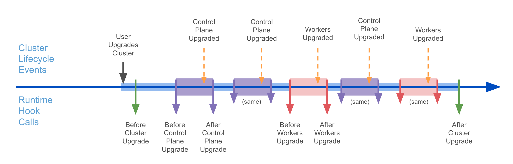

# Chained and efficient upgrades for Clusters with managed topologies

## Table of Contents

<!-- TOC -->
* [Chained and efficient upgrades for Clusters with managed topologies](#chained-and-efficient-upgrades-for-clusters-with-managed-topologies)
  * [Table of Contents](#table-of-contents)
  * [Glossary](#glossary)
  * [Summary](#summary)
  * [Motivation](#motivation)
    * [Goals](#goals)
    * [Future Work](#future-work)
    * [Non-Goals](#non-goals)
  * [Proposal](#proposal)
    * [User Stories](#user-stories)
    * [Implementation Details/Notes/Constraints](#implementation-detailsnotesconstraints)
      * [Upgrade plan](#upgrade-plan)
      * [Performing chained upgrades](#performing-chained-upgrades)
      * [Lifecycle hooks](#lifecycle-hooks)
    * [Security Model](#security-model)
    * [Risks and Mitigations](#risks-and-mitigations)
  * [Alternatives](#alternatives)
  * [Upgrade Strategy](#upgrade-strategy)
  * [Additional Details](#additional-details)
    * [Test Plan](#test-plan)
    * [Graduation Criteria](#graduation-criteria)
    * [Version Skew Strategy](#version-skew-strategy)
  * [Implementation History](#implementation-history)
<!-- TOC -->

## Glossary

- **Chained upgrade**: an upgrade sequence that goes from one Kubernetes version to another
  by passing through a set of intermediate versions. e.g., Upgrading from v1.31.0 to v1.33.0 requires
  a chained upgrade with the following intermediate steps: v1.31.0 (initial state) -> v1.32.0 (intermediate version)
  -> v1.33.0 (target version)

- **Efficient upgrade**: a chained upgrade where workers node skips some of the intermediate versions,
  when allowed by the [Kubernetes version skew policy](https://kubernetes.io/releases/version-skew-policy/).

- **Upgrade plan**: the sequence of intermediate versions that a Cluster must upgrade to when 
  performing a chained upgrade; when the chained upgrade is also an efficient upgrade,
  the upgrade plan for worker machines is a subset of the upgrade plan for control plane machines.

## Summary

This proposal will allow Cluster API users with Clusters using managed topologies to upgrade by more than one minor
Kubernetes version by performing chained and efficient upgrades.

## Motivation

[KEP-3935](https://github.com/kubernetes/enhancements/pull/3936) extended the [Kubernetes version skew policy](https://kubernetes.io/releases/version-skew-policy/),
making it possible to minimize the number of worker's machines rollouts when upgrading by more than one minor.

Cluster API users could already benefit from this Kubernetes feature by orchestrating upgrade of different
components like KCP and MachineDeployments.

However, as of today, Cluster API users with Clusters using managed topologies cannot benefit from this feature, 
because the topology controller only implements support for upgrading from one minor to the next one.

This proposal will remove this gap and allow Cluster API users with Clusters using managed topologies to upgrade
by more than one minor Kubernetes version by performing chained and efficient upgrades.

### Goals

- Allow Cluster API users using managed topologies to perform chained upgrades.
- Automatically perform efficient upgrades whenever possible.
- Allow Cluster API users to influence the upgrade plan considering e.g. availability of machines images for
  the intermediate versions.

### Future Work

- Consider if and how to allow users to change the target version while a chained upgrade is being performed.

### Non-Goals

- Support Kubernetes version downgrades.

## Proposal

### User Stories

- As a user, I want to upgrade my Cluster using a managed topology by more than one minor version by simply changing
  the value in `cluster.spec.topology.version`.

- As a user, I want that Cluster API automatically minimize the number of worker's machines rollouts 
  when upgrading a Cluster using managed topology by more than one minor.

- As a cluster class author, I want to be able to specify the Kubernetes versions that the system might use as
  intermediate or target versions for a chained upgrades for a Cluster using a specific cluster class.

- As a developer building on top of Cluster API, I want that lifecycle hooks allow orchestration of my external process
  during different steps of a chained upgrade.

### Implementation Details/Notes/Constraints

This proposal is composed of three sets of changes:

- Improvements required to determine the upgrade plan for a chained upgrade.
- Improvements required to perform chained and efficient upgrades.
- Improvements to upgrade related Lifecycle hooks.

#### Upgrade plan

To compute an upgrade plan it is required to determine the sequence of intermediate Kubernetes versions that a Cluster
must go through when performing a chained upgrade to a target version. The following changes will make it possible:

The ClusterClass CR will be extended to make it possible to define the list of Kubernetes versions that can be
used for chained upgrades of the corresponding clusters.

```yaml
apiVersion: cluster.x-k8s.io/v1beta1
kind: ClusterClass
metadata:
  name: quick-start-runtimesdk
spec:
  upgrade:
    versions:
    - v1.28.0
    - v1.29.0
    - v1.30.0
    - v1.30.1
    - v1.31.2
    - ... 
```

When computing the upgrade plan from Kubernetes vA to vB, Cluster API will use the latest version for each minor in
between vA and vB. 

In the example above, the upgrade plan from v1.28.0 to v1.31.2, will be: v1.29.0 -> v1.30.1 -> v1.31.2
(by convention, the current version is omitted by the upgrade plan, the target version is included).

Note: Cluster API cannot determine the list of available Kubernetes versions automatically, because the versions that can be used 
in a Cluster API management cluster depend on external factors, e.g., by the availability of machine images for a Kubernetes version.

As an alternative to explicitly setting the list of versions in a ClusterClasses, it will all also be possible to define 
a runtime extension to be called when computing an upgrade plan; this extension could be used to return a
dynamically computed list of Kubernetes versions that can be used.

```yaml
apiVersion: cluster.x-k8s.io/v1beta1
kind: ClusterClass
metadata:
  name: quick-start-runtimesdk
spec:
  upgrade:
    external:    
      getUpgradePlanExtension: get-upgrade-plan.foo
```

Example Request:

```yaml
apiVersion: hooks.runtime.cluster.x-k8s.io/v1alpha1
kind: GetUpgradePlanRequest
settings: <Runtime Extension settings>
cluster:
  apiVersion: cluster.x-k8s.io/v1beta1
  kind: Cluster
  metadata:
    name: test-cluster
    namespace: test-ns
  spec:
    ...
  status:
    ...
fromKubernetesVersion: "v1.29.0"
toKubernetesVersion: "v1.33.0"
```

Example Response:

```yaml
apiVersion: hooks.runtime.cluster.x-k8s.io/v1alpha1
kind: GetUpgradePlanResponse
status: Success # or Failure
message: "error message if status == Failure"
controlPlaneVersions:
- v1.30.0
- v1.31.0
- v1.32.3
- v1.33.0
 ```

Implementers of this runtime extension can also support more sophisticated use cases, e.g.

- Go through more patch release for a minor if necessary, e.g., v1.30.0 -> v1.30.1 -> etc.

  ```yaml
  ...
  controlPlaneVersions:
  - v1.30.0
  - v1.30.1
  - ...
  ```
  
- Force workers to upgrade to specific versions, e.g., force workers upgrade to v1.30.0 when doing v1.29.0 -> v1.32.3
  (in this example, worker upgrade to 1.30.0 is not required by the [Kubernetes version skew policy](https://kubernetes.io/releases/version-skew-policy/), so it would
  be skipped under normal circumstances).

  ```yaml
  ...
  controlPlaneVersions:
  - v1.30.0
  - v1.31.0
  - v1.32.3
  workersVersions:
  - v1.30.0
  ```
  
- Force workers to upgrade to all the intermediate steps (opt out from efficient upgrades).

  ```yaml
  ...
  controlPlaneVersions:
  - v1.30.0
  - v1.31.0
  - v1.32.3
  workersVersions:
  - v1.30.0
  - v1.31.0
  - v1.32.3
  ```
  
Please note:
- In case both the list of Kubernetes versions and the runtime extension definition will be left empty in a cluster class, 
  Cluster API will behave as of today: only upgrades to the next minor are allowed for the corresponding clusters.
- If the list of Kubernetes versions is defined in a ClusterClass, the system is going to use this info to:
  - Validate the target version for an upgrade of a corresponding cluster
  - Check if there is a valid upgrade path from the current version to the target version.
- If instead, the ClusterClass is reading upgrade plans from a runtime extension, the system is NOT going to use it 
  to validate the target version for an upgrade of a corresponding cluster.
  - This limitation is driven by the fact that adding nested http calls into webhooks might lead to performance
    issues; also, in most cases advanced users already are implementing additional checks for cluster upgrades, and they
    need full flexibility in how to integrate the upgrade plan checks.
- During a chained upgrade, The system will ensure that the upgrade plan is continuously re-computed, thus
  adapting to changes to the list of Kubernetes versions that can be used.
  - If during a chained upgrade the system fails to determine a viable upgrade path to make
    progress, the upgrade will be blocked and the issue reported in a condition.

#### Performing chained upgrades

The topology controller is the component responsible to orchestrate upgrades for clusters using a managed topology,
and it will be improved to:
- compute the upgrade plan (when an upgrade is required/in progress)
- perform the upgrade sequence accordingly

While the first change can be inferred from the previous paragraph, the second change requires some additional details.

The topology controller is already capable of performing two atomic operations used during upgrades, "upgrade control
plane" and "upgrade workers"; as of today, these two operations are performed sequentially, one after the other.

This proposal is planning to use existing "upgrade control plane" and "upgrade workers" primitives multiple times
to perform chained and efficient upgrades, e.g., v1.29.0 -> v1.33.0 will be executed as:

| Operation                          | Note                                                                       |
|------------------------------------|----------------------------------------------------------------------------|
| CP upgrade v1.29.0 -> v1.30.0      | workers can remain on v1.29.0                                              |
| CP upgrade v1.30.0 -> v1.31.0      | workers can remain on v1.29.0                                              |
| CP upgrade v1.31.0 -> v1.32.0      |                                                                            |
| Workers upgrade v1.31.0 -> v1.32.0 | workers must upgrade to prevent violation of Kubernetes version skew rules |
| CP upgrade v1.32.0 -> v1.33.0      |                                                                            |
| Workers upgrade v1.32.0 -> v1.33.0 |                                                                            |

The mechanics of how "upgrade control plane" and the mechanics of "upgrade workers" operations are performed won't change
from today.

This is specifically important for "upgrade workers", which by default is upgrading MachineDeployments first, 
one after the other according to the order defined in `cluster.spec.topology`, and then MachinePools in a similar way.

Notably, also the exiting options to influence "upgrade workers" will continue to work as of today: 
- `topology.cluster.x-k8s.io/upgrade-concurrency` annotation can be used to configure the maximum concurrency while
  upgrading MachineDeployments of a classy Cluster. It is set as a top level annotation on the Cluster object.
- `topology.cluster.x-k8s.io/defer-upgrade` annotation can be used to defer the Kubernetes upgrade of MachineDeployments
  in `Cluster.spec.topology.workers`.
- `topology.cluster.x-k8s.io/hold-upgrade-sequence` can be used to hold the upgrade sequence for a MachineDeployment
  in `Cluster.spec.topology.workers` and all the following ones.

It also remains unchanged the fact that an "upgrade workers" operation cannot complete until all the MachineDeployment
are upgraded to the intermediate/target version of this iteration, which is possible only after all the `topology.cluster.x-k8s.io/defer-upgrade` and 
`topology.cluster.x-k8s.io/hold-upgrade-sequence` annotations are removed.

However, it might be worth to notice that:
- While performing different "upgrade workers" iterations, the target version all Machine deployment should upgrade to also changes.
- `topology.cluster.x-k8s.io/defer-upgrade` and `topology.cluster.x-k8s.io/hold-upgrade-sequence` annotations,  must be
  applied before each upgrade step (lifecycle hooks described in the next paragraph can be used to orchestrate this process).

#### Lifecycle hooks

As of today, Cluster API implements three lifecycle hooks for upgrades:
- `BeforeClusterUpgrade`
- `AfterControlPlaneUpgrade`
- `AfterClusterUpgrade`

By introducing chained upgrades, it is necessary to expand this set to allow proper tracking of the intermediate steps.



More specifically:
- `BeforeClusterUpgrade` request will include the upgrade plan.
- A new `BeforeControlPlaneUpgrade` hook will be added and called before each "upgrade control plane" step;
  request and response payload will be similar to corresponding messages for `BeforeClusterUpgrade`
- `AfterControlPlaneUpgrade` hook will now be called after each "upgrade control plane" step.
- A new `BeforeWorkersUpgrade` hook will be added and called before each "upgrade workers" step;
  request and response payload will be similar to corresponding messages for `BeforeControlPlaneUpgrade`
- A new `AfterWorkersUpgrade` hook will be added and called after each "upgrade workers" step;
  request and response payload will be similar to corresponding messages for `AfterControlPlaneUpgrade`, but the
  hook will be considered blocking only for the intermediate steps of the upgrade (not blocking for the final step).
- `AfterClusterUpgrade` will remain as of today, but the system will ensure that a new upgrade
  can't start until `AfterClusterUpgrade` is completed.

### Security Model

This proposal does not add additional security concern to Cluster API.

### Risks and Mitigations

- Upgrading a Cluster by multiple Kubernetes minor versions in a short timeframe might increase risks to face issues during the upgrade.

This proposal aims to help users those risks by automating the chained upgrade workflow so users can catch up with 
Kubernetes versions easily, quickly, and with an upgrade plan validated by the system.

Also, worth to notice that each machine rollout in Cluster API ultimately is an operation that is exercising 
the same machinery that will be used during upgrades. 

That means that by doing any rollout, e.g. due to an automatic machine remediation, you get a proxy signal about the
fact that the system can successfully perform an upgrade, or you get the chance to detect and fix issues in the system
before a full upgrade is performed.

Conversely, risk increase for users not performing any form of rollouts for long periods.

- Upgrading a Cluster by multiple Kubernetes minor versions might compromise workloads.

Each Kubernetes minor upgrade might include changes impacting workloads running in the Cluster, and going through
multiple minors increases the chance that workloads running in a cluster are impacted.

As a mitigation, this proposal is improving lifecycle hooks and giving full visibility in the upgrade plan, thus
allowing users to implement additional pre-upgrade checks.

## Alternatives

An alternative to option leveraging a new CRs to define the list of Kubernetes version to be used for upgrade plans
was considered.

However, the option was discarded because it seems more consistent having the list of 
Kubernetes version to be used for upgrade plans in ClusterClasses, alongside all the other info defining 
how a managed topology should behave.  

## Upgrade Strategy

No particular upgrade considerations are required, this feature will available to users upgrading to
Cluster API v1.11.

However, it is required to enhance ClusterClasses with the information required to compute upgrade plans,
otherwise the system will keep supporting only upgrade to the next minor for the corresponding clusters (opt-in). 

## Additional Details

### Test Plan

Considering the entire range of [Kubernetes versions currently supported by Cluster API](https://cluster-api.sigs.k8s.io/reference/versions#kubernetes-versions-support) 
plus the Kubernetes version currently under development (from N-6 to N+1), more than twenty additional E2E tests are 
required to get full coverage of the possible chained upgrade sequences. 

While implementing all those new tests is not impossible, it is considered not practical because the resulting E2E
job would take a long time while current E2E jobs allow a fast iterative development process.

Accordingly, int the first iteration only one chained upgrade test scenario going from N-3 to N+1 will be validated, 
but this is considered enough to ensure that:
- The mechanics for chained upgrade works
- [Kubernetes version skew policy](https://kubernetes.io/releases/version-skew-policy/) is respected, and workers upgrade are performed only when necessary
- Lifecycle hooks are called
- Resulting K8s cluster pass the conformance test

This new test will run periodically, and also be available to be run on demand on PRs.

### Graduation Criteria

This feature should be considered part of ClusterClass and managed topologies, and thus it will follow the same graduation process.

### Version Skew Strategy

This proposal does not change the [Cluster API version skew policy](https://cluster-api.sigs.k8s.io/reference/versions#skip-upgrades)
nor the [Cluster API - Cluster API provider version Skew policy](https://cluster-api.sigs.k8s.io/reference/versions#supported-cluster-api---cluster-api-provider-version-skew).

Also worth to notice that this proposal implements safeguards to enforce [Kubernetes version skew policy](https://kubernetes.io/releases/version-skew-policy/) when using clusters 
with managed topologies.

## Implementation History

- [ ] 05/05/2023: Proposed idea in https://github.com/kubernetes-sigs/cluster-api/issues/8616
- [ ] 05/07/2025: Presented proposal at a community meeting
- [ ] 05/13/2025: Open proposal PR
