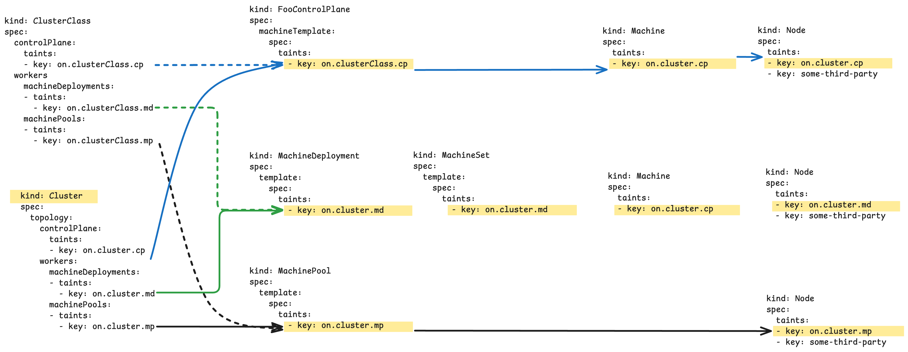

# Propagating taints from Cluster API to `Node`s

## Table of Contents

<!-- START doctoc generated TOC please keep comment here to allow auto update -->
<!-- DON'T EDIT THIS SECTION, INSTEAD RE-RUN doctoc TO UPDATE -->


- [Glossary](#glossary)
- [Summary](#summary)
- [Motivation](#motivation)
  - [Goals](#goals)
  - [Non-Goals/Future Work](#non-goalsfuture-work)
- [Proposal](#proposal)
  - [User Stories](#user-stories)
    - [Story 0](#story-0)
    - [Story 1](#story-1)
    - [Story 2](#story-2)
    - [Story 3](#story-3)
  - [Requirements (Optional)](#requirements-optional)
    - [Functional Requirements](#functional-requirements)
      - [FR1](#fr1)
      - [FR2](#fr2)
  - [Implementation Details/Notes/Constraints](#implementation-detailsnotesconstraints)
    - [The `.spec.taints` field on a `Node`](#the-spectaints-field-on-a-node)
    - [Propagation of taints](#propagation-of-taints)
    - [Proposed API changes](#proposed-api-changes)
      - [Type definition of a taint in Cluster API objects](#type-definition-of-a-taint-in-cluster-api-objects)
      - [Changes to the Machine, MachineSet, MachineDeployment and MachinePool resources via MachineSpec](#changes-to-the-machine-machineset-machinedeployment-and-machinepool-resources-via-machinespec)
      - [Changes to the ClusterClass and Cluster API for topology-aware clusters](#changes-to-the-clusterclass-and-cluster-api-for-topology-aware-clusters)
    - [Proposed contract changes](#proposed-contract-changes)
      - [Changes to the boostrap provider contract](#changes-to-the-boostrap-provider-contract)
      - [Changes to the ControlPlane contract](#changes-to-the-controlplane-contract)
    - [Proposed controller changes](#proposed-controller-changes)
      - [Changes to the Machine and MachinePool controllers](#changes-to-the-machine-and-machinepool-controllers)
      - [Changes to the Cluster topology, MachineSet and MachineDeployment controllers](#changes-to-the-cluster-topology-machineset-and-machinedeployment-controllers)
  - [Security Model](#security-model)
    - [Migration strategy for Bootstrap providers](#migration-strategy-for-bootstrap-providers)
  - [Risks and Mitigations](#risks-and-mitigations)
- [Alternatives](#alternatives)
- [Upgrade Strategy](#upgrade-strategy)
- [Additional Details](#additional-details)
  - [Test Plan [optional]](#test-plan-optional)
  - [Graduation Criteria [optional]](#graduation-criteria-optional)
- [Implementation History](#implementation-history)

<!-- END doctoc generated TOC please keep comment here to allow auto update -->

## Glossary

Refer to the [Cluster API Book Glossary](https://cluster-api.sigs.k8s.io/reference/glossary.html).

## Summary

This proposal introduces taints as a first-class citizen in Cluster API's core types, enabling users to declaratively manage Node taints through higher-level Cluster API resources such as Cluster, ClusterClass, MachineSet, MachineDeployment and MachinePool.

The proposal defines two different kind of propagation modes for taints:

- **Always**: Taints are continuously reconciled and maintained on nodes
- **Initialize**: Taints are set once during node initialization and then left unmanaged

NOTE: This new proposal has been created rather than updating the prior [in-place metadata propagation](20221003-In-place-propagation-of-Kubernetes-objects-only-changes.md) proposal because taints are not yet part of the Core Provider's API types and are different enough from labels or annotations that a different set of constraints will need to be considered.
Very early versions of Kubernetes tracked taints as annotations, but they have long since been [promoted to their own API type](https://github.com/kubernetes/kubernetes/commit/9b640838a5f5e28db1c1f084afa393fa0b6d1166)

## Motivation

As stated in the goals of the project, Cluster API tries to "to define common operations" and "manage the lifecycle [...] of Kubernetes-conformant Clusters using a declarative API"[0].
Users of Cluster API can currently update labels and annotations on Cluster API objects and have those values propagate from their high level resources all the way down to nodes (see the [related proposal](./20220927-labels-and-annotations-sync-between-machine-and-nodes.md) for more context).
While this is useful, it does not provide a way to, for example, reserve a set of nodes for specific workloads like GPU or network functions.

As of today defining custom taints for nodes can be done via bootstrap providers, e.g. via CABPK's `nodeRegistration.taints` field in a `KubeadmConfig`[1] or by adding them manually after Node creation.
In case of CABPK updating taints currently also requires a rollout.

Also CAPI already manages the `node.cluster.x-k8s.io/uninitialized` and `node.cluster.x-k8s.io/outdated-revision` taints today.

This proposal aims to standardize the way users can define taints for nodes in workload Clusters as well as how they get propagated in case of changes.

### Goals

- Make taints a first-class citizen in core Cluster API types.
- Define how taints get propagated to corresponding `Node`'s.
- Define how a migration from a bootstrap provider's implementation of taints to the new feature could look like (taking CABPK as example).
- Taints managed by Cluster API should not interfere with taints applied by other actors.

### Non-Goals/Future Work

- Supporting taints on individual devices via [Dynamic Resource Allocation](https://kubernetes.io/docs/concepts/scheduling-eviction/dynamic-resource-allocation/#device-taints-and-tolerations). This may be added in the future, but is currently out of scope.

## Proposal

### User Stories

#### Story 0

In Kubernetes Clusters, taints and tolerations are what allow a workload to be scheduled to a specific Node.
As a user, I would like to use this community-standard mechanism within the framework that Cluster API provides.

#### Story 1

As a user, I wish to use Cluster API to manage a set of Machines that have very specific characteristics for targetting workloads.
Some examples of this might be:
    - Designating Nodes as `edge` Nodes and steering locality-critical workloads only to `edge` Nodes.
    - Designating Nodes as having a particular hardware capability, such as high performance GPUs

#### Story 2

As a user, I wish to have autoscaling capabilities using Kubernets and Cluster API resources and conventions.
I would like for taints defined on a Cluster API resource representing some collection (including but not limited to Clusters, MachineSets, MachinePools, and MachineDeployments).
This is especially useful in scale-from-zero scenarios, where that autoscaling technology can reference taints on a collection to make decisions about the cloud resources available.

#### Story 3

As a user, I would like to update taint metadata on my collection resources without forcing a complete replacement of an owned resource, such as a Machine or Node.

### Requirements (Optional)

#### Functional Requirements

Functional requirements are the properties that this design should include.

##### FR1

Users should be able to define Taints on collection resources and have the taints propagate to the owned resources.
This would start at a `ClusterClass` or `Cluster` level, and ultimately be written to a `Node`.

##### FR2

Users should be able to remove Taints managed by Cluster API without removing taints that Cluster API does not manage.

### Implementation Details/Notes/Constraints

#### The `.spec.taints` field on a `Node`

Cluster API already supports propagating labels and annotations downward in its resource heirarchy.
This support is implemented such that when these fields are updated, the underlying compute resources are _not_ replaced.

Taints present a challenge to this, because they are defined as an "atomic" field by Kubernetes.[^1]
This means that when updating Taints on a `Node`, _all_ `Taint`s are replaced; it is not possible to add and replace individual elements like labels and annotations.
As a concrete example, if a Node has 3 taints and some client submits a patch request with only one, the end result is one taint on the Node.
It also means that Server-Side Apply ownership rules could not be applied to individual taints, which could present conflicts between controllers or users trying to modify `Taints` on the resultant `Node`.

For Cluster API to support propagating `Taint`s, it will need to:

- implement its own mechanism for tracking what `Taint`s it owns.
- ensure there are no conflicts with other actors by always setting the `metadata.resourceVersion` on API calls changing the taints on a Node.

#### Propagation of taints

A taint for a Node may be defined for different use-cases:

- Taint's supposed to stay on the Node to ensure only certain workload runs on such a `Node` aka. `Always`:
  - This taint are supposed to be set on the `Node` object as long as it is defined on its parent core CAPI object.
  - Example: Nodes where only run GPU related workload should run
  - CAPI controllers should ensure via reconciliation that such a taint gets added again in case a third party removes it.
- Taint's supposed to get added once to a Node aka. `Initialize`
  - This taints are supposed to be set **once** on the `Node` object.
  - Example: Ensure that no workload gets scheduled to a `Node` unless the taint got removed to e.g. install a GPU driver before allowing workload.
  - CAPI should once set the taint on the Node and not add it again if it got removed.

#### Proposed API changes

##### Type definition of a taint in Cluster API objects

Note: To reduce verbosity, this proposal does not include all kinds of validation markers.

The following defines a new struct which should be used to define taints at the corresponding API types.
It replicates the upstream corev1.Taint specification and extends it by a field called `propagation`, which will define the propagation mechanism to use for the taint.
Using a type definition allows to be extensible and add additional propagation mechanisms when necessary.

```golang
// MachineTaint defines a taint equivalent to corev1.Taint, but additionally having a propagation field.
type MachineTaint struct {
  // key is the taint key to be applied to a Node.
  // +required
  Key string `json:"key"`

  // value is the taint value corresponding to the taint key.
  // +optional
  Value string `json:"value,omitempty"`

  // effect is the effect for the taint. Valid values are NoSchedule, PreferNoSchedule and NoExecute.
  // +required
  // +kubebuilder:validation:Enum=NoSchedule;PreferNoSchedule;NoExecute
  Effect corev1.TaintEffect `json:"effect"`

  // propagation defines how this taint should be propagated to Nodes.
  // Always: The taint will be continuously reconciled. If removed from a node, it will be re-added.
  // Initialize: The taint will be added during node initialization. If removed, it will not be re-added.
  // +required
  Propagation MachineTaintPropagation `json:"propagation"`
}

// MachineTaintPropagation defines when a taint should be propagated to Nodes.
// +kubebuilder:validation:Enum=Always;Initialize
type MachineTaintPropagation string

const (
  // TaintPropagationAlways means the taint should be continuously reconciled and kept on the Node.
  // If removed, it will be re-added during reconciliation.
  TaintPropagationAlways MachineTaintPropagation = "Always"

  // TaintPropagationInitialize means the taint should be set once during initialization and then
  // left alone. If removed, it will not be re-added.
  TaintPropagationInitialize MachineTaintPropagation = "Initialize"
)
```

Proper validations on the new field should ensure that no taint with a key of `node.cluster.x-k8s.io/uninitialized` is getting added, because that one is restricted to be used by CAPI and providers.

Open question: alternative to consider, e.g. specific struct, (negative: not as extensible):
* example
  ```golang
  type MachineTaints struct{
    Always        []corev1.Taint `json:"always,omitempty"`
    Initialization []corev1.Taint `json:"initialization,omitempty"`
  }
  ```
* FIXME(chrischdi): if decided this should move down to alternative approaches.

##### Changes to the Machine, MachineSet, MachineDeployment and MachinePool resources via MachineSpec

Note: To reduce verbosity, this proposal does not include all kinds of required validation markers.

This proposes to add a field array to the `MachineSpec` struct.
This implicitly leads to adding the field to the following types:

| API Type            | New field                    |
|---------------------|------------------------------|
| `Machine`           | `.spec.taints`               |
| `MachineSet`        | `.spec.template.spec.taints` |
| `MachineDeployment` | `.spec.template.spec.taints` |
| `MachinePool`       | `.spec.template.spec.taints` |

```golang

type MachineSpec struct{
  // taints are the node taints that Cluster API will manage.
  // This list is not necessarily complete: other Kubernetes components may add or remove other taints.
  // Only those taints defined in this list will be added or removed by core Cluster API controllers.
  //
  // NOTE: This list is implemented as a "map" type, meaning that individual elements can be managed by different owners.
  // As of Kubernetes 1.33, this is different from the implementation on corev1.NodeSpec, but provides a more flexible API for components building on top of Cluster API.
  // +optional
  // +listType=map
  // +listMapKey=key
  // +listMapKey=value
  // +listMapKey=effect
  Taints []MachineTaint `json:"taints,omitempty"`

  // Other fields...
}
```

##### Changes to the ClusterClass and Cluster API for topology-aware Clusters

This proposes to add the same field array to ClusterClass and the topology section of Cluster for the controlPlane and workers sections.

The following table summarizes the new fields:

| API Type       | New field                                           |
|----------------|-----------------------------------------------------|
| `ClusterClass` | `spec.controlPlane.taints`                          |
|                | `spec.workers.machineDeployments[].taints`          |
|                | `spec.workers.machinePools[].taints`                |
| `Cluster`      | `spec.topology.controlPlane.taints`                 |
|                | `spec.topology.workers.machineDeployments[].taints` |
|                | `spec.topology.workers.machinePools[].taints`       |

The propagation of the fields should follow the prior art and is summarized in the following picture:



As implemented for the ReadinessGates, add taints on a Cluster should lead to only adding the taints from the ClusterClass.

```golang
type ControlPlaneClass struct {
  // taints are the node taints that Cluster API will manage.
  // ...
  Taints []MachineTaint `json:"taints,omitempty"`

  // Other fields...
}

type MachineDeploymentClass struct{
  // taints are the node taints that Cluster API will manage.
  // ...
  Taints []MachineTaint `json:"taints,omitempty"`

  // Other fields...
}

type MachinePoolClass struct{
  // taints are the node taints that Cluster API will manage.
  // ...
  Taints []MachineTaint `json:"taints,omitempty"`

  // Other fields...
}
```

#### Proposed contract changes

##### Changes to the bootstrap provider contract

Document that `Initialize` taints are only added when a bootstrap provider supports the `node.cluster.x-k8s.io/uninitialized` taint.
For details, see below paragraph "[Changes to the Machine, MachineSet, MachineDeployment and MachinePool resources via MachineSpec](#changes-to-the-machine-machineset-machinedeployment-and-machinepool-resources-via-machinespec)".

##### Changes to the ControlPlane contract

To support taints for control plane Machines, the contract for ControlPlanes should be extended.

Similar to the extension for `ReadinessGates` at the `Machines` section, an additional optional  `FooControlPlaneMachineTemplate` rule should be added for supporting taints.

Support and usage of that field would result in having the defined taints set on the Machines created by the ControlPlane provider and the Machine controller being responsible to behave as for worker Machines.

#### Proposed controller changes

##### Changes to the Machine and MachinePool controllers

The Machine and MachinePool controllers as of today already manage the lifecycle of the taint `node.cluster.x-k8s.io/uninitialized`.

These controllers should make use of that taint and add all `Initialize` taints at the same time as they remove it from a corresponding Node.
This ensures that a node ever only gets these taints added once at the time of finishing initialization of a Node.

If a Node re-registers itself and this includes having the `node.cluster.x-k8s.io/uninitialized`, the controllers also would again add the `Initialize` taints.

Also all `Always` taints should get set for the first time, before or at the time of the removal of `node.cluster.x-k8s.io/uninitialized`.

Also at this stage the controllers could check and (re-)add all taints of the `Always` type.

Note: With this change we should also add the information to the "Contract rules for BootstrapConfig" documentation, that `Initialize` taints are only added when a bootstrap provider supports  the `node.cluster.x-k8s.io/uninitialized`.

To keep track of which taints have been added by the controller, the controller also adds the annotation `cluster.x-k8s.io/taints-from-machine` to the Node.
This follows the convention established by `cluster.x-k8s.io/labels-from-machine`.

The taints will be concatenated with `,` and the serialization will look like this given the 4 ways a taint can be specified:
`cluster.x-k8s.io/taints-from-machine:<key1>=<value1>:<effect1>,<key2>=<value2>:,<key3>:<effect3>,<key4>`

See the upstream [string implementation](https://github.com/kubernetes/kubernetes/blob/master/staging/src/k8s.io/api/core/v1/taint.go) for more details.

##### Changes to the Cluster topology, MachineSet and MachineDeployment controllers

The Cluster's topology controller will properly calculate and in-place propagate the new introduced taint fields down to the ControlPlane object (if it complies with the optional contract part), MachineDeployment and/or MachinePool resources.

The MachineDeployment and MachineSet controllers will watch their associated `MachineSpec` for updates to the `spec.taints` field and update their owned objects objects (MachineSet or Machine) to reflect the new values.

This should be done similar to how the existing in-place mutable fields like `ReadinessGates`, `NodeDrainTimeout`, etc. for a Machine are handled today.

### Security Model

Users who can define `Taint`s that get placed on `Node`s will be able to steer workloads, possibly to malicious hosts in order to extract sensitive data.
However, users who can define Cluster API resources already have this capability - an attacker who receives the permissions to update a `MachineTemplate` could alter the definition in a similar manner.

This proposal therefore does not present any heightened security requirements than Cluster API already has.

#### Migration strategy for Bootstrap providers

With the introduction of the new fields, bootstrap providers could start deprecating their equivalent fields.

For CABPK, adding a taint at a KubeadmConfigTemplate at `.spec.template.spec.joinConfiguration.nodeRegistration.taints`. is almost equivalent to adding a `Initialization` typed taint by the new API.
The only difference is that the taint does get added by the controllers after the Node joined the Cluster.

This is considered okay, because workload should not be able to be schedule workload unless the `node.cluster.x-k8s.io/uninitialized` taint was removed and the implementation should take care to have added the `Initialization` taints before or at the time removing this taint.

### Risks and Mitigations

Managing the `Taint`s on `Node`s is considered a highly privileged action in Kubernetes; it even has its own top level `kubectl taint` command.
The Kubernetes scheduler uses taints rather than `Conditions` to decide when to evict workloads.
Updating these in place could then evict workloads unintentionally, or disrupt other systems that rely on taints being present.

This risk can be mitigated by ensuring Cluster API only modifies taints that it owns on nodes, as decribed in the above.

## Alternatives

Deciding whether or not to reconcile taint changes continuously has been a challenge for the Cluster API.
Historically, the v1alpha1 API included a `Machine.Taints` field.
However, since this field was mostly used in cluster bootstrapping, it was later extracted into bootstrap provider implementations.
There is no standard API in bootstrap provider's though for taints.

Moving forward, two broad alternatives that have been explored in light of this: adding taints only at bootstrap time, and making taints immutable at the `Machine` level. Both methods would require that a Node be replaced in order to make any changes to the taints.

While this simplifies the implementation logic for Cluster API, it may be surprising to many users, since the Kubernetes documentation presents taints as a mutable field on a Node.
This would also mean that there are two different behaviors when modifying metadata within Cluster API, which could again be very confusing.
There is already precedent for leaving infrastructure in-place when Kubernetes-only fields are modified, and this proposal seeks to align with the established function.

## Upgrade Strategy

Taint support is a net-new field, and therefore must be optional and not affect upgrades.

## Additional Details

[^1]: It is worth noting that there has been discussion about making the taints on a Node a "map" list type and allowing for ownership of individual taints.
As of this writing, the [pull request](https://github.com/kubernetes/kubernetes/pull/128866) and [issue](https://github.com/kubernetes/kubernetes/issues/117142) remain open.
This proposal should be unaffected regardless of any upstream change to the handling of taints, except that using a "map" type would simplify the implementation and allow us to cooperate with other field managers.


### Test Plan [optional]

- There should be proper unit and integration test coverage when introducing the changes.
- An e2e test should validate the high-level user-experience
  - Usage of an `Initialize` and `Always` taint
  - Adding or removing an `Always` and `Initialize` taint on day 2

### Graduation Criteria [optional]

Open question: Should we feature-gate this new field?

Considering that "not setting the fields" should be equivalent to "disabling the feature gate" seems to be good enough.

<!-- 
**Note:** *Section not required until targeted at a release.*

Define graduation milestones.

These may be defined in terms of API maturity, or as something else. Initial proposal should keep
this high-level with a focus on what signals will be looked at to determine graduation.

Consider the following in developing the graduation criteria for this enhancement:
- [Maturity levels (`alpha`, `beta`, `stable`)][maturity-levels]
- [Deprecation policy][deprecation-policy]

Clearly define what graduation means by either linking to the [API doc definition](https://kubernetes.io/docs/concepts/overview/kubernetes-api/#api-versioning),
or by redefining what graduation means.

In general, we try to use the same stages (alpha, beta, GA), regardless how the functionality is accessed.

[maturity-levels]: https://git.k8s.io/community/contributors/devel/sig-architecture/api_changes.md#alpha-beta-and-stable-versions
[deprecation-policy]: https://kubernetes.io/docs/reference/using-api/deprecation-policy/
-->

## Implementation History

- [ ] 2025-01-15: First discussions at the [community meeting]
- [ ] 2025-06-06: Open proposal PR
- [ ] 2025-10-13: Reworked the proposal based on feedback

<!-- Links -->
[0]: https://main.cluster-api.sigs.k8s.io/introduction#goals
[1]: https://github.com/kubernetes-sigs/cluster-api/blob/51ab638dcef154f1e6f772314912237dd4665f0c/api/bootstrap/kubeadm/v1beta2/kubeadm_types.go#L325-L330
[community meeting]: https://docs.google.com/document/d/1ushaVqAKYnZ2VN_aa3GyKlS4kEd6bSug13xaXOakAQI/edit#heading=h.pxsq37pzkbdq
