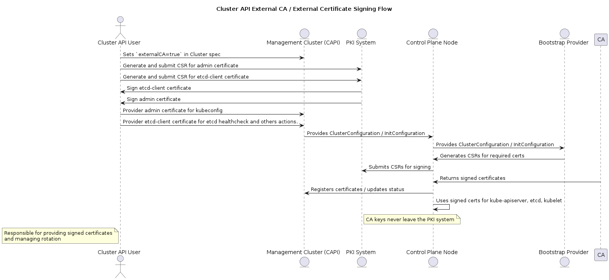

# Title

Enabling Cluster API to integrate with fully External CA and delegate certificate signing

## Table of Contents

<!-- START doctoc generated TOC please keep comment here to allow auto update -->
<!-- DON'T EDIT THIS SECTION, INSTEAD RE-RUN doctoc TO UPDATE -->

- [Glossary](#glossary)
- [Summary](#summary)
- [Motivation](#motivation)
  - [Goals](#goals)
  - [Non-Goals/Future Work](#non-goalsfuture-work)
- [Proposal](#proposal)
  - [User Stories](#user-stories)
    - [Story 1](#story-1)
    - [Story 2](#story-2)
  - [Security Model](#security-model)
- [Upgrade Strategy](#upgrade-strategy)
- [Implementation History](#implementation-history)

<!-- END doctoc generated TOC please keep comment here to allow auto update -->

## Glossary

Refer to the [Cluster API Book Glossary](https://cluster-api.sigs.k8s.io/reference/glossary.html).

### External CA

An External Certificate Authority (CA) is a CA that exists outside the Cluster API (CAPI) management plane. Instead of having Cluster API generate and manage its own self-signed CA for cluster components (such as kube-apiserver, kubelet, and etcd), an external CA can be integrated to provide trusted root certificates. This is typically used in environments where certificate lifecycles are centrally managed for compliance, auditing, or security policy reasons.

### External certificate signing

External certificate signing is the process of delegating certificate issuance to a signing service instead of relying on self-signed certificates generated by Cluster API or a [bootstrap provider](https://cluster-api.sigs.k8s.io/reference/glossary.html#bootstrap-provider). With this approach, the Cluster API user becomes responsible for providing the signed certificates, ensuring their signing by the external CA, and managing their rotation over time.

## Summary

This proposal introduces the ability for CAPI to integrate with fully external Certificate Authorities (CAs), meaning that CA key never leaves the external system. It also supports external certificate signing, where all certificate issuance is delegated externally. Cluster components generate Certificate Signing Requests (CSRs) that are signed by the external CA, providing a centralized and consistent trust chain across cluster bootstrap and lifecycle operations.

With this approach, the CAPI user is responsible for setting up a system to provide signed certificates, coordinate signing with the external CA, and manage certificate rotation over time. This enables integration with enterprise PKI systems, enforces organizational security policies, and ensures compliance with regulatory requirements while maintaining secure communication between cluster components.

## Motivation

Currently, CAPI generates and manages CA keys within the management cluster. These keys are also distributed to control plane nodes via cloud-init userdata during bootstrap. This design exposes several security risks:

- Key exposure in the management cluster: Anyone with access to the management cluster potentially has access to the CA keys.
- Key transit over cloud-init: The CA private keys travel over cloud-init user data during control plane provisioning, which could be intercepted or leaked.
- Privilege escalation risk: With access to CA keys, an attacker can sign admin or superadmin certificates, gaining full control over clusters and workloads.

For reference, native Kubernetes clusters generate CA keys and store them on control plane nodes. This also represents a security risk because compromise of a control plane node could allow signing of highly privileged certificates.

By integrating fully external CAs and delegating certificate signing externally:

- CA keys never leave the external system, removing the risk of compromise through the management cluster or cloud-init.
- Cluster API users can implement centralized enterprise PKI practices, ensuring strict access control and auditability for certificate issuance.
- Overall trust in cluster bootstrap and lifecycle operations is increased, mitigating a high-impact attack vector that currently exists in both Cluster API and native Kubernetes.

This proposal addresses a critical security gap, providing users with a mechanism to eliminate CA key exposure while maintaining full Kubernetes functionality.

### Goals

- Enable Cluster API to integrate with fully external Certificate Authorities (CAs) where CA private keys never leave the external system.
- Support external certificate signing for cluster components (control plane and nodes), delegating certificate issuance to an external CA or signing service.
- Allow users to implement their own PKI workflow, including certificate provisioning, signing, and rotation, while maintaining secure cluster bootstrap and lifecycle operations.
- Reduce the attack surface related to CA key exposure during cluster bootstrap, management, and rotation.
- Maintain compatibility with existing bootstrap providers while using external signing.

### Non-Goals/Future Work

- Cluster API will not provide a built-in external CA service; users remain responsible for setting up and managing the external CA.
- This feature does not replace existing certificate management solutions such as cert-manager; rather, it provides a mechanism to integrate them.
- This proposal does not modify Kubernetes internal certificate signing behavior beyond enabling delegation to an external authority.

## Proposal

To support external certificate signing and fully external CAs in CAPI, this proposal introduces a spec-level flag in the Cluster resource, e.g., externalCA, externalCAKey, or externalCertSigning. This flag will indicate that the cluster should operate in "external CA mode."

Key aspects of the proposal:

### External CA mode

When the flag is enabled, CA keys are no longer required in the CAPI management cluster and must not be stored or validated in secrets.
CAPI will not generate or manage CA private keys. The CA certificates needs to be provided by the user in Kubernetes secrets with the current format:

- <cluster-name>-etcd
- <cluster-name>-ca
- <cluster-name>-proxy
  CAPI should wait for the CA certificates if they are not already provided. CAPI must not adopt these Secrets, as they are the responsibility of the user.”

### Certificates necessary to Cluster API

Certificates such as the etcd client certificate and the admin certificate for the kubeconfig are normally generated by CAPI. In external CA mode, these certificates are still needed, but their provisioning and lifecycle management become the responsibility of the user. Users can leverage their own certificate management system, such as cert-manager or any other certificate management solution, to sign and rotate these certificates.

The etcd client certificate should be provided by the user in a secret named <cluster-name>-apiserver-etcd-client
The kubeconfig admin certificate should be provided by the user in a secret named <cluster-name>-admin

### Kubeadm Bootstrap: ClusterConfiguration and InitConfiguration

When using Kubeadm bootstrap, the command kubeadm certs generate-csr requires a configuration file containing ClusterConfiguration and/or InitConfiguration. Currently these files are only provided to the initialization control plane.
These configurations must be provided to joining control plane nodes because they contain the necessary information to generate Certificate Signing Requests (CSRs) for their components. The joining control plane nodes will generate CSRs locally and submit them to the external CA or user-provided signing system.

Below the workflow that describe this proposal.

### User Stories

#### Enterprise PKI Integration

As a Cluster API user in an enterprise environment, I want to delegate certificate signing to our corporate CA, so that CA keys never reside in the management cluster and certificate issuance complies with organizational security policies.

#### Flexible Bootstrap Provider Support

As a Cluster API user I want that it provides all necessary configuration to bootstrap providers to be compatible with external signing, so that I can maintain secure certificate flows regardless of the underlying bootstrap mechanism.

### Security Model

The External CA / External Certificate Signing feature is designed to minimize exposure of CA private keys and improve the overall security posture of Cluster API clusters. The security model includes the following key points:

- CA private keys never leave the external CA system.
- Cluster API and management clusters do not store CA keys in secrets.

## Upgrade Strategy

No special upgrade plan is required for this feature. Enabling external CA and external certificate signing does not break existing Cluster API behavior. Clusters that use the default internal CA workflow will remain fully functional.

## Additional Details

## Implementation History

- [x] 08/05/2025: Proposed idea in an issue
- [x] 09/03/2025: First round of feedback from community
- [x] 09/08/2025: Open proposal PR
- [ ] MM/DD/YYYY: Present proposal at a [community meeting]

<!-- Links -->

[community meeting]: https://docs.google.com/document/d/1ushaVqAKYnZ2VN_aa3GyKlS4kEd6bSug13xaXOakAQI/edit#heading=h.pxsq37pzkbdq
