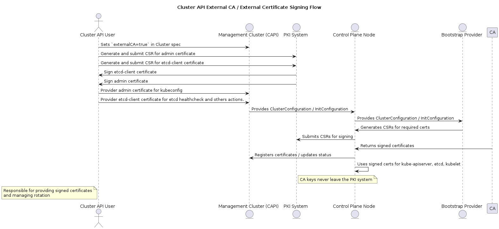

# Title

Enabling control plane and bootstrap providers to integrate with External CA and delegate certificate signing

## Table of Contents

<!-- START doctoc generated TOC please keep comment here to allow auto update -->
<!-- DON'T EDIT THIS SECTION, INSTEAD RE-RUN doctoc TO UPDATE -->

- [Glossary](#glossary)
- [Summary](#summary)
- [Motivation](#motivation)
  - [Goals](#goals)
  - [Non-Goals/Future Work](#non-goalsfuture-work)
- [Proposal](#proposal)
  - [User Stories](#user-stories)
    - [Story 1](#story-1)
    - [Story 2](#story-2)
  - [Security Model](#security-model)
- [Upgrade Strategy](#upgrade-strategy)
- [Implementation History](#implementation-history)

<!-- END doctoc generated TOC please keep comment here to allow auto update -->

## Glossary

Refer to the [Cluster API Book Glossary](https://cluster-api.sigs.k8s.io/reference/glossary.html).

### External CA

An External Certificate Authority (CA) is a CA that exists outside the Cluster API (CAPI) management plane. Instead of having control plane providers generate and manage their own self-signed CA for cluster components (such as kube-apiserver, kubelet, and etcd), an external CA can be integrated to provide trusted root certificates. This is typically used in environments where certificate lifecycles are centrally managed for compliance, auditing, or security policy reasons.
Today, only "Custom CA" is supported in CAPI [Custom CA](https://cluster-api.sigs.k8s.io/tasks/certs/using-custom-certificates#using-custom-certificates).

### External certificate signing

External certificate signing is the process of delegating certificate issuance to a signing service instead of relying on self-signed certificates generated by control plane or [bootstrap providers](https://cluster-api.sigs.k8s.io/reference/glossary.html#bootstrap-provider). Under this model, Cluster API delegates the provisioning and management of signed certificates to external systems or users. This approach ensures that certificates are issued by a trusted external CA, while the surrounding automation (or the platform integrator) takes charge of the end-to-end lifecycle, including secure delivery and timely rotation.

## Summary

This proposal introduces the ability for Cluster API control plane and bootstrap providers to integrate with external Certificate Authorities (CAs), meaning that CA keys never leave the external system. It also supports external certificate signing, where all certificate issuance is delegated externally. Cluster components generate Certificate Signing Requests (CSRs) that are signed by the external CA, providing a centralized and consistent trust chain across cluster bootstrap and lifecycle operations.

With this approach, the platform integrator is responsible for setting up a system to provide signed certificates, coordinate signing with the external CA, and manage certificate rotation over time. This enables integration with enterprise PKI systems, enforces organizational security policies, and ensures compliance with regulatory requirements while maintaining secure communication between cluster components.

## Motivation

The current design of control plane and bootstrap providers, which leverages self-signed certificates generated within the management cluster, offers a highly automated and self-contained lifecycle for clusters. This approach is widely accepted as it provides a robust security baseline when combined with proper access control on the management cluster and secure handling of machine userdata.

By integrating external CAs and delegating certificate signing externally:

- CA keys never leave the external system, removing the risk of compromise through the management cluster or cloud-init.
- Platform integrators can implement centralized enterprise PKI practices, ensuring strict access control and auditability for certificate issuance.
- Overall trust in cluster bootstrap and lifecycle operations is increased, mitigating a high-impact attack vector that currently exists in default Kubernetes deployments and, by extension, Cluster API workload cluster.

However, for organizations with stricter security requirements or those operating in multi-tenant environments where management cluster isolation is harder to enforce, the current model presents specific trade-offs:

- Key exposure in the management cluster: Anyone with access to the management cluster's Secrets has access to the CA keys.
- Key transit over cloud-init: The CA private keys travel over cloud-init user data during control plane provisioning, which could be intercepted or leaked.
- Privilege escalation risk: With access to CA keys, an attacker can sign admin or superadmin certificates, gaining full control over clusters and workloads.

In a default configuration, Kubernetes with kubeadm generates and stores CA keys locally on the control plane nodes. This also represents a security risk because compromise of a control plane node could allow signing of highly privileged certificates.

This proposal provides users with a mechanism to eliminate CA key exposure while maintaining full Kubernetes functionality.

### Goals

- Enable control plane and bootstrap providers to integrate with external Certificate Authorities (CAs) where CA private keys never leave the external system.
- Make possible to use external certificate signing for cluster components (control plane and nodes), delegating certificate issuance to an external CA or signing service. This allows platform integrators to implement their own PKI workflow, including certificate provisioning, signing, and rotation, while maintaining secure cluster bootstrap and lifecycle operations.
- Reduce the attack surface related to CA key exposure during cluster bootstrap and management.

### Non-Goals/Future Work

- Providers will not include a built-in external CA service; platform integrators remain responsible for setting up and managing the external CA.
- This feature does not replace existing certificate management solutions such as cert-manager; rather, it provides a mechanism to integrate them.
- This proposal does not modify Kubernetes internal certificate signing behavior beyond enabling delegation to an external authority.
- The automated rotation of the Certificate Authorities themselves is not in scope for this proposal.
- This proposal does not protect against all damages if an attacker gains access to the management cluster, control plane nodes, or cluster admin credentials.
- The management of the Service Account (SA) key pair is not covered by this proposal and remains handled by the existing logic.
- Migration from internal CA to external CA on an existing cluster is not supported. Users should create new clusters with external CA mode from the start.

## Proposal

This proposal defines changes to the Cluster API contract to enable control plane and bootstrap providers to operate in external CA mode, where CA private keys never leave the external PKI system. The approach is designed to be minimal and infer external CA mode automatically, avoiding unnecessary API changes.

### Cluster API Contract Changes

This section defines the contract changes required for external CA mode support. These changes apply generically to any control plane or bootstrap provider implementation.

#### Detection of External CA Mode

Control plane providers automatically infer external CA mode when:

- CA secrets exist and contain `ca.crt` but **no** `ca.key`

The absence of the CA private key in the CA secret signals that certificate signing must be delegated to an external system.

#### Certificate Secrets Contract

**CA Certificate Secrets:**

CA certificates must be provided by the platform integrator or an external system. Each CA secret must contain:

- `ca.crt`: The CA certificate (required)
- `ca.key`: Must **NOT** be present (presence triggers automatic mode detection)

Providers must wait for CA certificates to be available before proceeding with cluster bootstrap. Providers must not adopt or modify these secrets.

**Client Certificate Secrets:**

Certain client certificates must be provided by the platform integrator when using external CA mode:

| Secret Type               | Required Keys        | Purpose                        |
| :------------------------ | :------------------- | :----------------------------- |
| Admin kubeconfig          | `tls.crt`, `tls.key` | Admin kubeconfig certificate   |
| API server to etcd client | `tls.crt`, `tls.key` | API server to etcd client cert |

The exact secret naming convention is provider-specific.

#### Certificate Status Condition

Control plane providers use the existing `CertificatesAvailable` condition, extended to support external CA mode.

The condition reports `true` when certificates are available for use. The condition reports `false` with an appropriate reason when certificates cannot be made available.

This proposal adds support for external CA mode detection and validates certificate availability accordingly, including detecting invalid configurations such as mixed mode where some CA secrets have keys while others don't.

The following additional reasons are defined:

- `MissingClientCertificate`: Required client certificate secret not found or invalid
- `MissingCAKey`: Inconsistent CA secret configuration (mixed mode)

#### Bootstrap Configuration Distribution

When using external CA mode, bootstrap providers may need to distribute additional configuration to control plane nodes to enable CSR generation. The specific configuration and distribution mechanism is provider-specific.

Below is the workflow that describes this proposal.



### Kubeadm Provider Implementation (KCP/CABPK)

This section describes how the Kubeadm Control Plane (KCP) and Kubeadm Bootstrap Provider (CABPK) implement the Cluster API contract for external CA mode.

#### Detection in KCP/CABPK

KCP automatically infers external CA mode when:

- CA secrets exist (`<cluster-name>-ca`, `<cluster-name>-etcd`, `<cluster-name>-proxy`)
- Secrets contain `ca.crt` but **no** `ca.key`

When external CA mode is detected:

- KCP does not validate or expect CA private keys in secrets
- KCP does not generate or rotate CA keys
- KCP waits for user-provided client certificates

#### Affected Certificates

The following table summarizes the certificates impacted by external CA mode:

| Certificate / Key Pair    | Responsibility  | Scope         | Location           | ClusterConfig Required | Notes                             |
| :------------------------ | :-------------- | :------------ | :----------------- | :--------------------: | :-------------------------------- |
| **Cluster CA**            | External system | KCP           | Management Cluster |           No           | Cert only in Secret               |
| **Etcd CA**               | External system | KCP           | Management Cluster |           No           | Cert only in Secret               |
| **Front Proxy CA**        | External system | KCP           | Management Cluster |           No           | Cert only in Secret               |
| **Etcd Client Cert**      | External system | KCP           | Management Cluster |           No           | Provided via Secret               |
| **Kubeconfig Admin Cert** | External system | CAPI Contract | Management Cluster |           No           | Provided via Secret               |
| **Controlplane Certs**    | External system | CABPK         | Controlplane node  |        **Yes**         | Generated via kubeadm CSR         |
| **Kubelet Cert**          | External system | CABPK         | node               |           No           | Post-init: via Kubernetes CSR API |

#### CA Certificate Secrets

CA certificates must be provided in Kubernetes secrets with the following naming convention:

- `<cluster-name>-etcd`
- `<cluster-name>-ca`
- `<cluster-name>-proxy`

Each Secret should follow this format:

```yaml
apiVersion: v1
kind: Secret
metadata:
  name: <cluster-name>-<etcd|ca|proxy>
type: Opaque
data:
  ca.crt: <base64-encoded-CA-certificate>
```

**Important:** These secrets must NOT contain `ca.key`.

#### Client Certificate Secrets

The following client certificate secrets must be provided:

| Secret Name                            | Required Keys        | Purpose                        |
| :------------------------------------- | :------------------- | :----------------------------- |
| `<cluster-name>-admin`                 | `tls.crt`, `tls.key` | Admin kubeconfig certificate   |
| `<cluster-name>-apiserver-etcd-client` | `tls.crt`, `tls.key` | API server to etcd client cert |

#### ClusterConfiguration Distribution

CABPK extends its behavior to provide ClusterConfiguration to **all control plane nodes** via cloud-init, not just the initial control plane node.

**Rationale:** The `kubeadm certs generate-csr` command requires ClusterConfiguration to generate valid CSRs with correct:

- API server SANs (`apiServer.certSANs`)
- Etcd endpoints and configuration
- Control plane endpoint
- DNS names and IP addresses

Without ClusterConfiguration, joining control plane nodes cannot generate correct CSRs for their components (apiserver, etcd, front-proxy certificates).

#### Implementation Patterns

The recommended approach for kubeadm-based providers combines two phases: initial bootstrap via pre-kubeadm scripts, followed by ongoing certificate management via the Kubernetes CSR API.

##### Phase 1: Initial Bootstrap (Pre-kubeadm Scripts)

**When:** First control plane node bootstrap, before Kubernetes API is available.

**Components:**

- External PKI: HashiCorp Vault, OpenBao, or enterprise PKI
- Authentication: Wrapped tokens, AppRole, or certificates
- Scripts injected via KubeadmConfig `files` and `preKubeadmCommands`

**Workflow:**

```
Node boot → cloud-init → preKubeadmCommands:
  1. Read auth token from file
  2. kubeadm certs generate-csr --config /etc/kubernetes/kubeadm-config.yaml
  3. POST CSR to external PKI API
  4. Receive signed certificate
  5. Place in /etc/kubernetes/pki/
→ kubeadm init
```

**Required for:**

- Initial control plane node (Kubernetes CSR API not yet available)
- Can also be used for joining control planes and workers

##### Phase 2: Ongoing Certificate Management (Kubernetes CSR API)

**When:** After cluster is operational, for certificate rotation and renewal.

**Components:**

- External CSR signer controller deployed in cluster
- RBAC configured for signer
- Connection to external PKI for signing (can use Kubernetes auth method)

**Workflow:**

```
kubelet generates CSR → Kubernetes API → CSR signer controller:
  1. Detects pending CSR
  2. Authenticates with external PKI (using Kubernetes auth or other method)
  3. Signs CSR with external CA
  4. Updates CSR status with signed certificate
→ kubelet receives certificate
```

**Benefits:**

- Automated certificate rotation
- No manual intervention required
- Consistent with Kubernetes native certificate management
- Can use Kubernetes auth method (kube-auth) for Vault/OpenBao authentication

##### Node Bootstrap Workflow

For details on the kubeadm CSR generation process, see the [Kubernetes documentation on signing CSRs for all certificates](https://kubernetes.io/docs/tasks/administer-cluster/kubeadm/kubeadm-certs/#signing-csrs-for-all-certificates).

**Initial Control Plane (first node):**

1. CAPI provides ClusterConfiguration + InitConfiguration via cloud-init
2. preKubeadmCommands:
   - Install CA certificates (no keys) in `/etc/kubernetes/pki/`
   - Authenticate with external PKI system
   - Generate CSRs: `kubeadm certs generate-csr --config /etc/kubernetes/kubeadm-config.yaml`
   - Submit CSRs to external PKI API
   - Receive signed certificates
   - Place certificates in `/etc/kubernetes/pki/`
3. `kubeadm init` uses pre-placed certificates

**Joining Control Plane Nodes:**

1. CAPI provides ClusterConfiguration via cloud-init (**change required**)
2. preKubeadmCommands: same as initial control plane
3. `kubeadm join` uses pre-placed certificates

**Worker Node Bootstrap:**

_Option A: Pre-kubeadm Scripts (consistent with control plane)_

1. Generate kubelet CSR
2. Submit to external PKI
3. Place certificate in `/var/lib/kubelet/pki/`

_Option B: Kubernetes CSR API (post-init only)_

1. kubelet generates CSR automatically
2. External CSR signer controller approves and signs
3. kubelet receives signed certificate
4. Requires cluster to be already operational

**Limitation:** Option B cannot be used for initial control plane bootstrap.

#### External PKI System Integration

Examples of external PKI systems compatible with this implementation:

- **HashiCorp Vault** - Enterprise secrets management with PKI engine
- **OpenBao** - Open-source Vault fork with PKI engine

Both support:

- PKI engine for certificate signing
- Kubernetes auth method (kube-auth) for Phase 2 automation
- Wrapped tokens and AppRole for Phase 1 bootstrap authentication

### User Stories

#### Enterprise PKI Integration

As a platform integrator in an enterprise environment, I want to delegate certificate signing to our corporate CA, so that CA keys never reside in the management cluster and certificate issuance complies with organizational security policies.

#### Flexible Provider Support

As a platform integrator, I want control plane and bootstrap providers to support external certificate signing, so that I can maintain secure certificate flows regardless of the underlying provider implementation.

### Security Model

The External CA / External Certificate Signing feature is designed to minimize exposure of CA private keys and improve the overall security posture of Cluster API clusters. The security model includes the following key points:

- CA private keys never leave the external CA system.
- Cluster API and management clusters do not store CA keys in secrets.

## Upgrade Strategy

### New Clusters

To create a cluster with external CA mode:

1. Create CA secrets with `ca.crt` only (no `ca.key`)
2. Create client certificate secrets (admin, apiserver-etcd-client)
3. Create the cluster with a control plane provider

The control plane provider will automatically detect external CA mode (by the absence of `ca.key` in CA secrets) and proceed accordingly.

### Migration from Internal CA to External CA

**This is explicitly a non-goal of this proposal.**

Reasoning:

- CA rotation in Kubernetes is complex and requires careful coordination
- All components must re-bootstrap with new CA certificates
- etcd data is signed with old CA, requiring special migration procedures
- This complexity is better addressed in a separate proposal for automated CA rotation

Users requiring external CA should create new clusters rather than migrate existing ones.

### Clusters Without External CA

Clusters created before this feature remains fully functional. The feature is opt-in and only activated when CA secrets lack private keys.

## Additional Details

## Implementation History

- [x] 08/05/2025: Proposed idea in an issue
- [x] 09/03/2025: First round of feedback from community
- [x] 09/08/2025: Open proposal PR
- [x] 24/09/2025: Present proposal at a [community meeting]

<!-- Links -->

[community meeting]: https://docs.google.com/document/d/1ushaVqAKYnZ2VN_aa3GyKlS4kEd6bSug13xaXOakAQI/edit#heading=h.pxsq37pzkbdq
