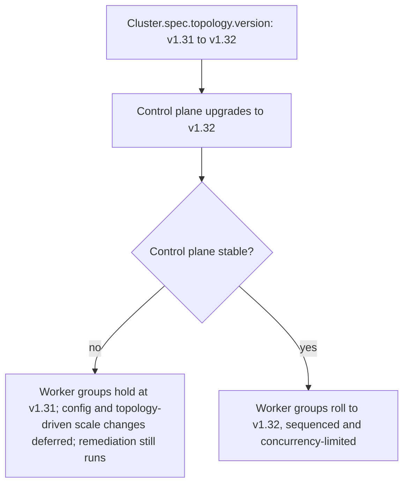
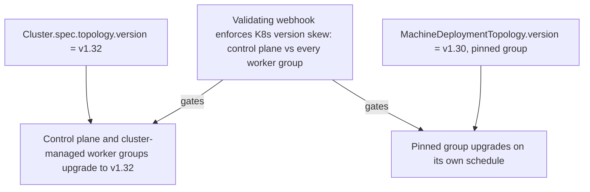

<!--
 Short-form proposal draft following the Cluster API CAEP template.
 Target location once ready: docs/proposals/YYYYMMDD-independent-worker-topology-versions.md
 (rename YYYYMMDD to the date the proposal PR is first opened).
 Supersedes the earlier WIP proposal PR: https://github.com/kubernetes-sigs/cluster-api/pull/12698
-->

# Independent Worker Topology Versions

## Table of Contents

- [Glossary](#glossary)
- [Summary](#summary)
- [Motivation](#motivation)
  - [Goals](#goals)
  - [Non-Goals/Future Work](#non-goalsfuture-work)
- [Proposal](#proposal)
  - [Overview](#overview)
  - [User Stories](#user-stories)
  - [API Changes](#api-changes)
  - [Behavior](#behavior)
  - [Security Model](#security-model)
  - [Risks and Mitigations](#risks-and-mitigations)
- [Alternatives](#alternatives)
- [Upgrade Strategy](#upgrade-strategy)
- [Additional Details](#additional-details)
  - [Test Plan](#test-plan)
  - [Version Skew Strategy](#version-skew-strategy)
- [Implementation History](#implementation-history)

## Glossary

Refer to the [Cluster API Book Glossary](https://cluster-api.sigs.k8s.io/reference/glossary.html).

- **Worker Node Group Version**: An optional Kubernetes version set on an individual
  `MachineDeploymentTopology` or `MachinePoolTopology` in a Cluster's topology. When set, it
  overrides the cluster-wide topology version (`Cluster.spec.topology.version`) for that one
  worker node group, allowing that group to be versioned and upgraded independently.

## Summary

Today, ClusterClass enforces a single Kubernetes version across the whole cluster topology.
This proposal adds an optional per-worker-node-group version so that individual worker node
groups can be upgraded independently of the control plane and of each other, within the limits
of the [Kubernetes version skew policy](https://kubernetes.io/releases/version-skew-policy/).
Cluster admins keep the benefits of ClusterClass while gaining fine-grained control over
upgrade timing and blast radius.

## Motivation

ClusterClass ties every worker node group to a single cluster-wide topology version
(`Cluster.spec.topology.version`) and upgrades them under one coupled, controller-driven
sequence. While a worker node group is waiting to take its version step, the topology
controller defers that group's config changes and topology-driven scaling so they roll out
together with the version bump, avoiding a double rollout (the `IsPendingUpgrade` early-return
in [`reconcile_state.go`](https://github.com/kubernetes-sigs/cluster-api/blob/main/internal/controllers/topology/cluster/reconcile_state.go);
machine remediation via MachineHealthCheck is deliberately exempt from this freeze). For
multi-minor upgrades the control plane and workers advance in lockstep — the control plane
takes a step, then waits for the workers to catch up before taking the next
([`desired_state.go`](https://github.com/kubernetes-sigs/cluster-api/blob/main/exp/topology/desiredstate/desired_state.go),
`ControlPlane.IsWaitingForWorkersUpgrade`). For large or heterogeneous clusters this coupling
creates real friction:

- A single worker group's rollout can take days, and no group can be upgraded independently of
  the cluster-wide version while it runs.
- Different workloads need different upgrade cadences (e.g. uninterruptible training jobs vs.
  customer-facing inference sharing one cluster via a custom scheduler).
- The only workarounds today — dropping ClusterClass for raw MachineDeployments, or splitting
  into many clusters — cost guardrails, features, and money.

Decoupling worker-group upgrades from the global cluster version keeps the ClusterClass
abstraction while removing this bottleneck.

### Goals

- Preserve existing ClusterClass version behavior when the feature is not used.
- Allow any single worker node group to be upgraded independently of the control plane and of
  other worker node groups.
- Keep normal operations (scaling, remediation, config changes) running on worker node groups
  that are *not* the one being upgraded.
- Support version skew between worker node groups and the control plane as allowed by the
  Kubernetes version skew policy, and keep the existing skew safety checks/guardrails.
- Keep version-aware patches predictable by using `builtin.machineDeployment.version` /
  `builtin.machinePool.version` as the source of truth for a group, even when it differs from
  `builtin.cluster.topology.version`.

### Non-Goals/Future Work

- **Allowing unsupported skew.** Only skew permitted by the Kubernetes version skew policy is
  allowed.
- **Version-aware built-in patches for independent groups.** Out of scope for this iteration;
  candidate for future work.
- **Automatically dropping a worker-group version override.** Reverting a group back to
  cluster-managed versioning (e.g. once all groups have caught up to the control plane) is
  deferred to future work to avoid adding another upgrade variant now.
- **Changing rollout behavior for groups not using the feature.** Groups without an
  independent version keep today's behavior; they are simply still included in skew checks.

## Proposal

### Overview

Today, one topology version drives the whole cluster, and a worker group waiting for its
version step has its config/scale changes deferred:



With this proposal, a group can pin its own version and upgrade on its own schedule; the
validating webhook keeps every group within the Kubernetes version skew policy relative to the
control plane:



### User Stories

1. **Independent control-plane vs. worker upgrades.** As a cluster admin, I want to upgrade the
   control plane without forcing a (potentially disruptive) worker upgrade that must be
   coordinated with tenants.
2. **Per-group upgrade scheduling.** As a cluster admin, I have multiple worker groups for
   different purposes (e.g. inference vs. training) that need different upgrade timing in the
   same cluster.
3. **No cluster-wide freeze.** As a cluster admin with many/large worker groups, I don't want
   every other group frozen while one group's multi-day rollout runs.
4. **Smaller blast radius.** As a cluster admin, I want to upgrade one worker group first to
   validate the change before rolling it out cluster-wide.

### API Changes

Add an optional `version` field to `MachineDeploymentTopology` and `MachinePoolTopology`:

```go
// version is the optional Kubernetes version for this worker node group.
// When set, it overrides Cluster.spec.topology.version for this group only,
// enabling independent version management and upgrade scheduling.
//
// Skew between this version and the control plane version is enforced per the
// Kubernetes version skew policy. If unset, the group uses Cluster.spec.topology.version.
//
// +optional
Version *string `json:"version,omitempty"`
```

The feature as a whole is guarded by a new feature gate — proposed name
`IndependentWorkerTopologyVersion` — that we will register (defaulted off) when we implement,
following the existing `ClusterTopology` gate in
[`feature/feature.go`](https://github.com/kubernetes-sigs/cluster-api/blob/main/feature/feature.go).
Cluster API gates behavior in controller and webhook code rather than via a field-level codegen
marker, so the gate is enforced by the topology controller and the validating webhooks (below);
the field is always present in the API and inert unless the gate is enabled. We will follow the
standard guide for adding a new field to an existing API version.

### Behavior

- **Feature gate off / created before enablement:** no independent versions; webhooks reject
  changes to worker-group versions and behavior is unchanged.
- **Excluded from cluster-level rollouts:** a group with an independent version is skipped by
  `Cluster.spec.topology.version` rollouts (and by chained upgrades), but is still evaluated by
  version-skew safety checks.
- **Validating webhooks** enforce:
  - allowable version skew between the control plane and every worker-group version (validated
    against both current and incoming versions);
  - a group can only return to cluster-managed versioning when its version already matches
    `Cluster.spec.topology.version`;
  - a worker-group version can only be set/changed while the cluster is otherwise stable (not
    mid-upgrade), matching today's rule that versions aren't changed during an in-progress
    upgrade.
- **Controller:** worker groups with a version set are excluded from the topology controller's
  pending/upgrading computation for cluster-level version rollouts (the `MarkPendingUpgrade`
  path in [`desired_state.go`](https://github.com/kubernetes-sigs/cluster-api/blob/main/exp/topology/desiredstate/desired_state.go)
  and the `Upgrading` list in [`scope/state.go`](https://github.com/kubernetes-sigs/cluster-api/blob/main/exp/topology/scope/state.go)),
  so a `Cluster.spec.topology.version` change does not roll them.
- **Preflight checks:** the MachineSet-level preflight checks that enforce version alignment
  today must be relaxed for groups with an independent version (while still enforcing the
  Kubernetes skew policy). In
  [`machineset_preflight.go`](https://github.com/kubernetes-sigs/cluster-api/blob/main/internal/controllers/machineset/machineset_preflight.go)
  these are `KubeadmVersionSkew` (requires the worker minor to equal the control plane minor;
  kubeadm bootstrap only) and `ControlPlaneVersionSkew` (requires the worker version to equal
  the control plane version). They run on scale-up and can be bypassed today via the
  `machineset.cluster.x-k8s.io/skip-preflight-checks` annotation
  ([`common_types.go`](https://github.com/kubernetes-sigs/cluster-api/blob/main/api/core/v1beta2/common_types.go));
  the feature should manage this automatically rather than requiring users to set the annotation
  by hand.

Key prerequisite — joining Machines at an older minor version — is being addressed
independently. kubeadm requires the kubeadm binary to match the control plane version. The
groundwork in [#13433](https://github.com/kubernetes-sigs/cluster-api/pull/13433) does not
itself download a binary; it exposes the control plane version to bootstrap `spec.files` as a
`{{ .controlPlane.version }}` template variable (rendered by `templateData`/`renderTemplates`
in [`bootstrap/kubeadm/internal/controllers/template.go`](https://github.com/kubernetes-sigs/cluster-api/blob/main/bootstrap/kubeadm/internal/controllers/template.go),
sourced from the control plane by `getControlPlaneVersion`; enabled by
`FileContentFormat: Template` in
[`kubeadmconfig_types.go`](https://github.com/kubernetes-sigs/cluster-api/blob/main/api/bootstrap/kubeadm/v1beta2/kubeadmconfig_types.go)).
An operator then supplies a `spec.files` entry that installs the matching kubeadm binary at
bootstrap, instead of relying on the image's baked-in version. This deliberately does **not**
change the kubeadm JoinConfiguration API version, which still follows the joining Machine's own
version. See [#13315](https://github.com/kubernetes-sigs/cluster-api/issues/13315).

### Security Model

No new security surface. The `version` field is part of the existing `Cluster` topology spec
and is governed by the same RBAC as the rest of `Cluster.spec.topology`; it stores no secret or
sensitive data. The feature relaxes the MachineSet version-skew preflight checks only within the
Kubernetes version skew policy, so it does not weaken existing guardrails beyond what that policy
already permits.

### Risks and Mitigations

- **Admin blocked by a forgotten pinned group.** A cluster-level version change can be denied
  because some worker group has a pinned version that would violate skew. Mitigation: surface a
  clear error via webhook validation and conditions, and let the admin align that group's
  version and remove the override to bring it back under cluster control.

## Alternatives

- **Raw MachineDeployments/MachinePools.** Attach non-topology MachineDeployments to a
  topology cluster. Loses ClusterClass guardrails (including skew safety) and worker classes.
- **One cluster per worker group.** Isolates upgrades but adds control-plane cost, complicates
  shared services and multi-tenant networking, requires cross-cluster config propagation, and
  still doesn't let you manage control-plane and worker versions independently within a
  cluster. Good fit for strong-isolation models, poor fit for shared single-cluster platforms.

## Upgrade Strategy

No impact on upgrading Cluster API itself. The behavior is opt-in: it requires the feature gate
to be enabled and the new API field to be set to have any effect.

## Additional Details

### Test Plan

- Existing behavior preserved when no worker-group versions are set (control plane + workers
  roll to the desired version).
- Setting a worker-group version for the first time triggers a rolling upgrade of only that
  group; other groups and the control plane keep operating normally.
- Cluster-level version upgrade on a cluster that has independent groups: skew validated
  against every group; independent groups are skipped, cluster-managed groups upgrade.
- Skew validation blocks any transition that would exceed the policy at any point (validating
  current↔incoming for control plane and each worker group).
- Config and topology-driven scale changes on independent groups are applied during upgrades
  rather than deferred; remediation continues (as it does today). All remain subject to skew
  safety checks.
- Feature-gate behavior: disabling the gate after use blocks version edits (with a clear
  "re-enable the gate" message) while allowing other edits.
- Chained upgrades: allowed only when no step violates skew with any pinned group; pinned
  groups are excluded from the chained upgrade.
- In-place upgrades follow the same rules as rolling upgrades.

### Version Skew Strategy

Skew between worker node groups and the control plane is bounded by the
[Kubernetes version skew policy](https://kubernetes.io/releases/version-skew-policy/), enforced
at admission by the validating webhooks and backstopped by the existing MachineSet preflight
checks (`KubeadmVersionSkew`, `ControlPlaneVersionSkew` in
[`machineset_preflight.go`](https://github.com/kubernetes-sigs/cluster-api/blob/main/internal/controllers/machineset/machineset_preflight.go)).
The kubeadm-specific constraint (the kubeadm binary must match the control plane version) is not
solved in core Cluster API: the groundwork in
[#13433](https://github.com/kubernetes-sigs/cluster-api/pull/13433) exposes the control plane
version to bootstrap `spec.files` as a `{{ .controlPlane.version }}` template variable, and the
operator supplies a file that installs the matching kubeadm binary. The kubeadm JoinConfiguration
API version continues to follow the joining Machine's own version.

Because this feature shifts responsibility for installing the matching kubeadm binary onto the
operator (and relaxes the MachineSet version-skew preflight checks), the
[experimental features documentation](https://cluster-api.sigs.k8s.io/tasks/experimental-features/experimental-features)
in the Cluster API book will be updated to clearly document this contract and the relaxed
preflight behavior, to avoid user surprise.

## Implementation History

- 2026-02-05: Proposal discussed in community meeting; task list drafted.
- 2026-02 to 2026-04: Prototyping (join at older version, lifecycle/upgrade-plan hooks, e2e with CAPD).
- 2026-05-29: [#13433](https://github.com/kubernetes-sigs/cluster-api/pull/13433) merged —
  writes the control plane version to a bootstrap file so workers can fetch the matching kubeadm
  binary (groundwork toward handling version skew).
- 2026-07-06: Short-form proposal drafted (this document), superseding WIP
  [#12698](https://github.com/kubernetes-sigs/cluster-api/pull/12698).
