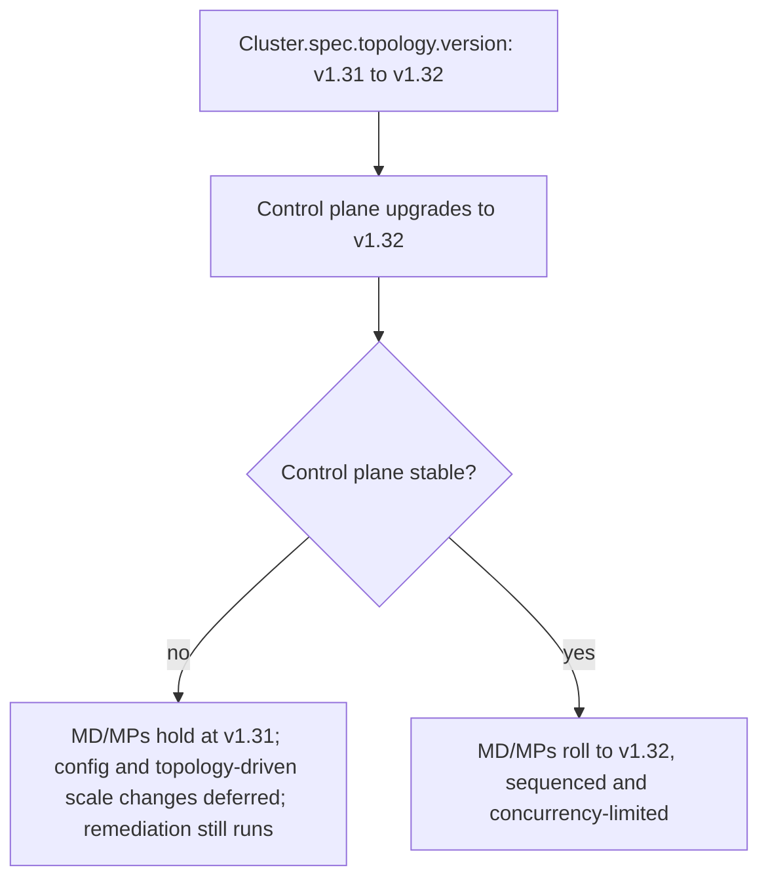
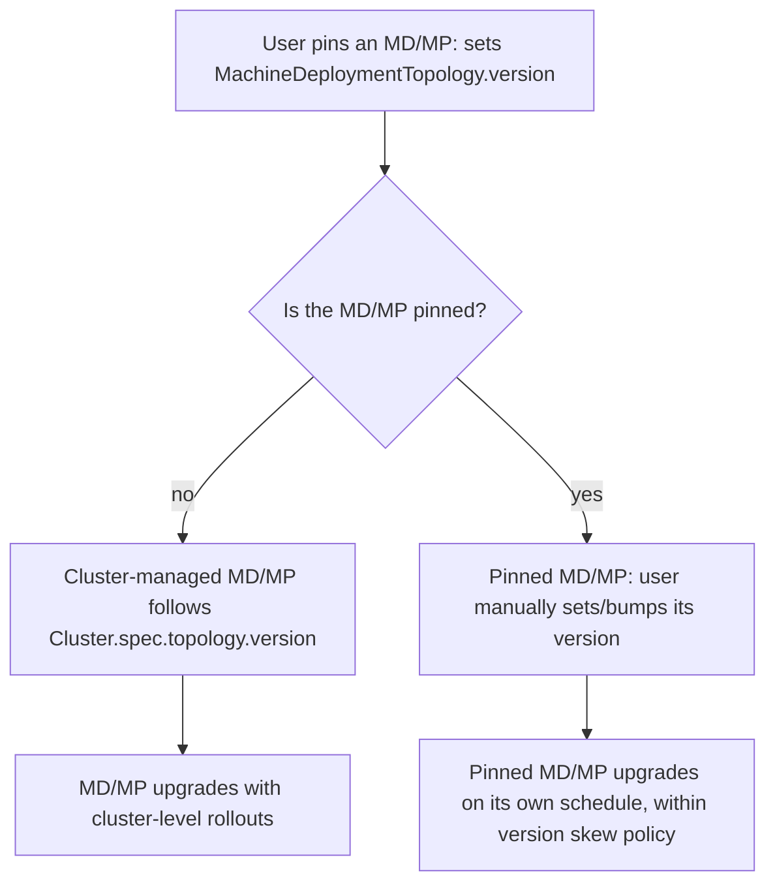
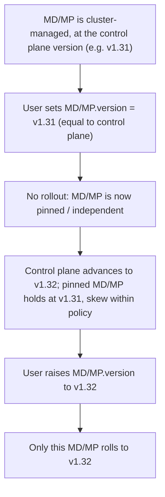

<!--
 Short-form proposal following the Cluster API CAEP template.
 Supersedes the earlier WIP proposal PR: https://github.com/kubernetes-sigs/cluster-api/pull/12698
-->

# Worker Version Pinning in Cluster API Managed Topologies

## Table of Contents

- [Glossary](#glossary)
- [Summary](#summary)
- [Motivation](#motivation)
  - [Goals](#goals)
  - [Non-Goals/Future Work](#non-goalsfuture-work)
- [Proposal](#proposal)
  - [Overview](#overview)
  - [User Stories](#user-stories)
  - [API Changes](#api-changes)
  - [Behavior](#behavior)
  - [Workflow](#workflow)
  - [Security Model](#security-model)
  - [Risks and Mitigations](#risks-and-mitigations)
- [Alternatives](#alternatives)
- [Upgrade Strategy](#upgrade-strategy)
- [Additional Details](#additional-details)
  - [Test Plan](#test-plan)
  - [Version Skew Strategy](#version-skew-strategy)
- [Implementation History](#implementation-history)

## Glossary

Refer to the [Cluster API Book Glossary](https://cluster-api.sigs.k8s.io/reference/glossary.html).

## Summary

Today, Cluster API managed topologies enforces a single Kubernetes version across the whole
cluster topology. This proposal adds an optional per-MachineDeployment/MachinePool (MD/MP)
version so that individual MD/MPs can be upgraded independently of the control plane and of each
other, within the limits of the
[Kubernetes version skew policy](https://kubernetes.io/releases/version-skew-policy/). Cluster
admins keep the benefits of Cluster API managed topologies while gaining fine-grained control
over upgrade timing and blast radius.

## Motivation

Cluster API managed topologies ties every MachineDeployment/MachinePool to a single
cluster-wide topology version (`Cluster.spec.topology.version`) and upgrades them under one
coupled, controller-driven sequence. While an MD/MP is waiting to take its version step, the
topology controller defers that MD/MP's config changes and topology-driven scaling so they roll
out together with the version bump, avoiding a double rollout (the `IsPendingUpgrade`
early-return in [`reconcile_state.go`](https://github.com/kubernetes-sigs/cluster-api/blob/main/internal/controllers/topology/cluster/reconcile_state.go);
machine remediation via MachineHealthCheck is deliberately exempt from this freeze). For
multi-minor upgrades the control plane advances one minor at a time and pauses before any step
that would exceed the version skew policy until workers catch up; workers themselves can skip
minors, upgrading directly to the target
([`desired_state.go`](https://github.com/kubernetes-sigs/cluster-api/blob/main/exp/topology/desiredstate/desired_state.go),
`ControlPlane.IsWaitingForWorkersUpgrade`).

This approach works well for most cases, by removing most of the upgrade toil from users, but in
large or heterogeneous clusters this coupling creates some friction:

- A single MD/MP's rollout can take days, and no group can be upgraded independently of the
  cluster-wide version while it runs.
- Different workloads need different upgrade cadences (e.g. uninterruptible training jobs vs.
  customer-facing inference sharing one cluster via a custom scheduler).
- Annotations can defer/hold an upgrade or control the upgrade sequence, but this only stretches
  the overall upgrade duration and still gives no proper granular per-MD/MP version control.
- The only other workarounds today — dropping Cluster API managed topologies for raw
  MachineDeployments, or splitting into many clusters — cost guardrails, features, and money.

This proposal introduces the possibility to pin versions/manual version management for specific
MD/MP, thus preserving all the benefits of Cluster API managed topologies abstraction while
removing the friction described above.

### Goals

- Preserve the existing Cluster API managed topologies version behavior when MD/MP version pinning is not used.
- Allow pinning versions/manually manage version for each MD/MP.
- Keep normal operations (scaling, remediation, config changes) running on MD/MPs with a pinned
  version; they are not frozen by cluster-level upgrades the way cluster-managed groups are today.
- Support version skew between MD/MPs and the control plane as allowed by the Kubernetes version
  skew policy, and keep the existing skew safety checks/guardrails.
- Keep version-aware patches predictable by using `builtin.machineDeployment.version` /
  `builtin.machinePool.version` as the source of truth for an MD/MP, even when it differs from
  `builtin.cluster.topology.version`.

### Non-Goals/Future Work

- **Allowing unsupported skew.** Only skew permitted by the Kubernetes version skew policy is
  allowed.
- **Automatic unpinning.** Pinning and unpinning are always explicit user actions. Cluster API
  never removes an MD/MP version automatically — e.g. it will not revert an MD/MP to
  cluster-managed versioning once it catches up to the control plane; the user must clear the
  field.
- **Changing rollout behavior for groups not using the feature.** Groups without a
  pinned version keep today's behavior.

## Proposal

### Overview

Today, one topology version drives the whole cluster, and an MD/MP waiting for its
version step has its config/scale changes deferred:



With this proposal, an MD/MP can pin its own version and upgrade on its own schedule. Version
skew between the control plane and every MD/MP is enforced at admission by the validating
webhooks:



### User Stories

1. **Independent control-plane vs. worker upgrades.** As a cluster admin, I want to upgrade the
   control plane without forcing a (potentially disruptive) worker upgrade that must be
   coordinated with tenants.
2. **Per-group upgrade scheduling.** As a cluster admin, I have multiple MachineDeployments/MachinePools for
   different purposes (e.g. inference vs. training) that need different upgrade timing in the
   same cluster.
3. **No cluster-wide freeze.** As a cluster admin with many/large MD/MPs, I don't want
   every other MD/MP frozen while one MD/MP's multi-day rollout runs.
4. **Smaller blast radius.** As a cluster admin, I want to upgrade one MD/MP first to
   validate the change before rolling it out cluster-wide.

### API Changes

Add an optional `version` field to `MachineDeploymentTopology` and `MachinePoolTopology`:

```go
// version is the optional Kubernetes version for this MachineDeployment/MachinePool.
// When set, it overrides Cluster.spec.topology.version for this MD/MP only,
// enabling manual version management and upgrade scheduling.
//
// Skew between this version and the control plane version is enforced according to the
// Kubernetes version skew policy.
//
// If unset, the MD/MP uses Cluster.spec.topology.version.
// Once set, the field can be unset only if the MD/MP version is equal to Cluster.spec.topology.version.
//
// +optional
Version *string `json:"version,omitempty"`
```

The feature as a whole is guarded by a new feature gate — proposed name
`WorkerVersionPinning` — that we will register (defaulted off) when we implement,
following the existing `ClusterTopology` gate in
[`feature/feature.go`](https://github.com/kubernetes-sigs/cluster-api/blob/main/feature/feature.go).
Cluster API gates behavior in controller and webhook code rather than via a field-level codegen
marker, so the gate is enforced by the topology controller and the validating webhooks (below);
the field is always present in the API and inert unless the gate is enabled. We will follow the
standard guide for adding a new field to an existing API version.

### Behavior

- **Feature gate off / created before enablement:** no pinned versions; webhooks reject
  changes to MD/MP versions and behavior is unchanged.
- **Feature gate on / excluded from cluster-level rollouts:** an MD/MP with a pinned
  version is skipped by `Cluster.spec.topology.version` rollouts (and by chained upgrades), but
  is still evaluated by version-skew safety checks.
- **Validating webhooks** enforce two sets of rules:
  - On `Cluster.spec.topology.version` changes:
    - the allowable version skew must hold between the control plane and every MD/MP version,
      validated against both the persisted value and the new value in the request, so no
      transition passes through a skew-violating state.
  - On the new `MachineDeployment/MachinePool.version` field:
    - the version must satisfy `currentVersion ≤ MD/MP.version ≤ controlPlane.version` — never
      above the control plane, never a downgrade. Because a cluster-managed MD/MP sits at the
      control plane version while the cluster is stable, the first set must equal the control
      plane version and therefore never triggers an upgrade on its own; upgrades happen only when
      the pin is later raised (see [Workflow](#workflow));
    - allowable version skew between the control plane and the MD/MP version, validated against
      both the persisted value and the new value in the request;
    - an MD/MP can only return to cluster-managed versioning when its version already matches
      `Cluster.spec.topology.version`;
    - an MD/MP version can only be set/changed while the cluster is otherwise stable (not
      mid-upgrade), matching today's rule that versions aren't changed during an in-progress
      upgrade.
- **Controller:** MD/MPs with a version set are excluded from the topology controller's
  pending/upgrading computation for cluster-level version rollouts (the `MarkPendingUpgrade`
  path in [`desired_state.go`](https://github.com/kubernetes-sigs/cluster-api/blob/main/exp/topology/desiredstate/desired_state.go)
  and the `Upgrading` list in [`scope/state.go`](https://github.com/kubernetes-sigs/cluster-api/blob/main/exp/topology/scope/state.go)),
  so a `Cluster.spec.topology.version` change does not roll them.
- **Version-aware patches:** patches keep working for pinned MD/MPs with no change to the patch
  engine. The `builtin.machineDeployment.version` / `builtin.machinePool.version` variables are
  already sourced from the desired MD/MP object's `spec.template.spec.version`
  ([`variables.go`](https://github.com/kubernetes-sigs/cluster-api/blob/main/internal/controllers/topology/cluster/patches/variables/variables.go)),
  which the topology controller computes in `computeMachineDeploymentVersion` /
  `computeMachinePoolVersion`. Once those functions target the pinned version for a pinned MD/MP,
  patches automatically render with that version. This is why version-aware patches are a goal,
  not a non-goal: skipping it would render patches with the wrong version. Note this is distinct
  from the kubeadm-binary propagation in [#13433](https://github.com/kubernetes-sigs/cluster-api/pull/13433),
  which exposes `{{ .controlPlane.version }}` to bootstrap `spec.files` — a separate path.
- **Preflight checks:** the MachineSet-level preflight checks that enforce version alignment
  today must be relaxed for MD/MPs with a pinned version (while still enforcing the
  Kubernetes skew policy). In
  [`machineset_preflight.go`](https://github.com/kubernetes-sigs/cluster-api/blob/main/internal/controllers/machineset/machineset_preflight.go)
  these are `KubeadmVersionSkew` (requires the worker minor to equal the control plane minor;
  kubeadm bootstrap only) and `ControlPlaneVersionSkew` (requires the worker version to equal
  the control plane version). They run on scale-up and can be bypassed today via the
  `machineset.cluster.x-k8s.io/skip-preflight-checks` annotation
  ([`common_types.go`](https://github.com/kubernetes-sigs/cluster-api/blob/main/api/core/v1beta2/common_types.go));
  the feature should manage this automatically rather than requiring users to set the annotation
  by hand.

Key prerequisite — joining Machines at an older minor version — is being addressed
independently. kubeadm requires the kubeadm binary to match the control plane version. The
groundwork in [#13433](https://github.com/kubernetes-sigs/cluster-api/pull/13433) does not
itself download a binary; it exposes the control plane version to bootstrap `spec.files` as a
`{{ .controlPlane.version }}` template variable (rendered by `templateData`/`renderTemplates`
in [`bootstrap/kubeadm/internal/controllers/template.go`](https://github.com/kubernetes-sigs/cluster-api/blob/main/bootstrap/kubeadm/internal/controllers/template.go),
sourced from the control plane by `getControlPlaneVersion`; enabled by
`FileContentFormat: Template` in
[`kubeadmconfig_types.go`](https://github.com/kubernetes-sigs/cluster-api/blob/main/api/bootstrap/kubeadm/v1beta2/kubeadmconfig_types.go)).
An operator then supplies a `spec.files` entry that installs the matching kubeadm binary at
bootstrap, instead of relying on the image's baked-in version. This deliberately does **not**
change the kubeadm JoinConfiguration API version, which still follows the joining Machine's own
version. See [#13315](https://github.com/kubernetes-sigs/cluster-api/issues/13315).

### Workflow

Pinning and upgrading a group is a two-step, always-explicit sequence. Setting the version the
first time never rolls the group; it only opts the group out of cluster-managed versioning.



1. **Pin (no-op).** Set `MachineDeploymentTopology.version` / `MachinePoolTopology.version` to the
   MD/MP's current version, which — at a stable cluster — equals the control plane version. This
   pins the group without triggering any rollout. A pin can never exceed the control
   plane version and can never move a group below the version it currently runs.
2. **Diverge.** Advance the control plane (the pinned group holds back, within the skew policy) or
   raise the group's pinned version toward the control plane. Raising the pin is what triggers a
   rolling upgrade of that group only.
3. **Unpin (explicit).** Clear the field to return the group to cluster-managed versioning; this
   is allowed only when the pinned version already equals `Cluster.spec.topology.version`. Cluster
   API never unpins automatically.

### Security Model

No new security surface. The `version` field is part of the existing `Cluster` topology spec
and is governed by the same RBAC as the rest of `Cluster.spec.topology`; it stores no secret or
sensitive data. The feature relaxes the MachineSet version-skew preflight checks only within the
Kubernetes version skew policy, so it does not weaken existing guardrails beyond what that policy
already permits.

### Risks and Mitigations

- **Admin blocked by a forgotten pinned MD/MP.** A cluster-level version change can be denied
  because some MD/MP has a pinned version that would violate skew. Mitigation: surface a
  clear error via webhook validation and conditions, and let the admin align that MD/MP's
  version and remove the override to bring it back under cluster control.

## Alternatives

- **Raw MachineDeployments/MachinePools.** Attach non-topology MachineDeployments to a
  topology cluster. Loses Cluster API managed topologies guardrails (including skew safety) and worker classes.
- **One cluster per group of workers.** Isolates upgrades but adds control-plane cost, complicates
  shared services and multi-tenant networking, requires cross-cluster config propagation, and
  still doesn't let you manage control-plane and worker versions independently within a
  cluster. Good fit for strong-isolation models, poor fit for shared single-cluster platforms.

## Upgrade Strategy

No impact on upgrading Cluster API itself. The behavior is opt-in: it requires the feature gate
to be enabled and the new API field to be set to have any effect.

## Additional Details

### Test Plan

- Existing behavior preserved when no MD/MP versions are set (control plane + workers
  roll to the desired version).
- Setting an MD/MP version for the first time (equal to the control plane version) is a no-op: it
  pins the group without triggering a rollout.
- Raising the version of an already-pinned MD/MP triggers a rolling upgrade of only that group;
  other groups and the control plane keep operating normally.
- Cluster-level version upgrade on a cluster that has pinned MD/MPs: skew validated
  against every MD/MP; pinned MD/MPs are skipped, cluster-managed MD/MPs upgrade.
- Skew validation blocks any transition that would exceed the policy at any point (validating
  persisted↔new for control plane and each MD/MP).
- Config and topology-driven scale changes on pinned MD/MPs are applied during upgrades
  rather than deferred; remediation continues (as it does today). All remain subject to skew
  safety checks.
- Feature-gate behavior: disabling the gate after use blocks version edits (with a clear
  "re-enable the gate" message) while allowing other edits.
- Chained upgrades: allowed only when no step violates skew with any pinned MD/MP; pinned
  MD/MPs are excluded from the chained upgrade.
- In-place upgrades follow the same rules as rolling upgrades.

### Version Skew Strategy

Skew between MD/MPs and the control plane is bounded by the
[Kubernetes version skew policy](https://kubernetes.io/releases/version-skew-policy/), enforced
at admission by the validating webhooks and backstopped by the existing MachineSet preflight
checks (`KubeadmVersionSkew`, `ControlPlaneVersionSkew` in
[`machineset_preflight.go`](https://github.com/kubernetes-sigs/cluster-api/blob/main/internal/controllers/machineset/machineset_preflight.go)).
The kubeadm-specific constraint (the kubeadm binary must match the control plane version) is not
solved in core Cluster API: the groundwork in
[#13433](https://github.com/kubernetes-sigs/cluster-api/pull/13433) exposes the control plane
version to bootstrap `spec.files` as a `{{ .controlPlane.version }}` template variable, and the
operator supplies a file that installs the matching kubeadm binary. The kubeadm JoinConfiguration
API version continues to follow the joining Machine's own version.

Because this feature shifts responsibility for installing the matching kubeadm binary onto the
operator (and relaxes the MachineSet version-skew preflight checks), the
[experimental features documentation](https://cluster-api.sigs.k8s.io/tasks/experimental-features/experimental-features)
in the Cluster API book will be updated to clearly document this contract and the relaxed
preflight behavior, to avoid user surprise.

## Implementation History

- 2026-02-05: Proposal discussed in community meeting; task list drafted.
- 2026-02 to 2026-04: Prototyping (join at older version, lifecycle/upgrade-plan hooks, e2e with CAPD).
- 2026-05-29: [#13433](https://github.com/kubernetes-sigs/cluster-api/pull/13433) merged —
  writes the control plane version to a bootstrap file so workers can fetch the matching kubeadm
  binary (groundwork toward handling version skew).
- 2026-07-06: Short-form proposal drafted (this document), superseding WIP
  [#12698](https://github.com/kubernetes-sigs/cluster-api/pull/12698).
