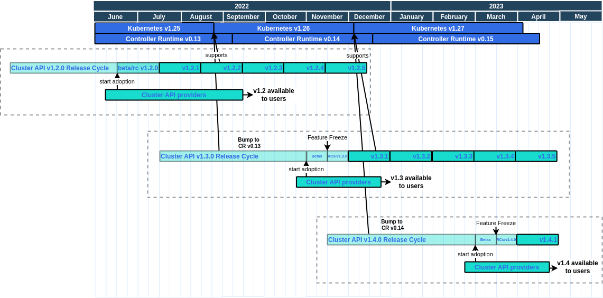

# Release Cycle

The release cycle is the time between when we start working on a release on the `main` branch until the `.0` release (e.g. `v1.3.0`) is released.

**Note**: For the `v1.3` and `v1.4` releases we assume each release cycle will last approximately 4 months (~ 17 weeks).
The release cycle duration will be revisited after the `v1.4.0` release.

A release cycle can be split up into the following phases:

* Week 1-12: Active development
    * All changes impacting providers' adoption of Cluster API should be implemented and merged in this period. Exceptions
      require special approval as described in the section below.
    * Alpha releases will be released based on the main branch only if necessary (to be determined by the release lead)
    * Please note that we also publish daily releases based on the main branch.
* Week 13-14: Beta
    * Weekly beta releases will be released based on the main branch
        * The beta releases are meant as a preview of the upcoming release
        * Providers can start adopting the new release based on the beta releases
    * All changes that impact providers' adoption of the new release should be announced in the provider updates section
      of the office hours meeting notes and approved in the PR or issue by both approvers and key affected providers.
        * Non-breaking dependency bumps which don't require provider changes don't have to be explicitly approved
          in addition to the regular PR review.
* Week 15-16: RC
    * The release branch is created
    * Weekly RC releases will be released based on the release branch
        * RC releases are as close as possible to the final release but they are still undergoing further testing
    * Development of the next release can technically start on the main branch, but some changes might be delayed
      to ensure easier cherry-picking of other changes to the release branch.
    * There is a feature freeze on the release branch
        * Only cherry-picks for documentation, bug fixes, test fixes and test additions are allowed
* Week 17: GA
    * `x.y.0` GA release is created based on the release branch
* After that:
    * **Note** The following is the responsibility of the release team of the following release cycle.
    * `x.y.1+`: Monthly patch releases will be released based on the release branch
    * Cherry-picks to the release branch are allowed according to the [backport policy](https://github.com/kubernetes-sigs/cluster-api/blob/main/CONTRIBUTING.md#backporting-a-patch)
    * Providers create releases using the new CAPI minor release when they are ready
    * Development of the next release can now officially start on the main branch

Some additional notes:

* Support for new Kubernetes minor versions (for management and workload clusters) is first implemented
  on the main branch, then cherry-picked into supported release branches when feasible and eventually
  released in the next monthly patch release(s).
    * **Note**: We usually don't have to bump Go dependencies to support new Kubernetes minor versions as it's not necessary
      to run on a management cluster with the new version or create a workload cluster with the new version.
      If it becomes necessary to bump dependencies to a new CR/Kubernetes minor version, the change cannot be cherry-picked
      as bumping dependencies to a new minor version is a breaking change.
* New Kubernetes and Controller-Runtime (CR) minor releases are only picked up on the main branch.

The following diagram visualizes the release cycles with the v1.2, v1.3 and v1.4 releases:

<!-- The release cycle png can be opened and edited in draw.io -->

